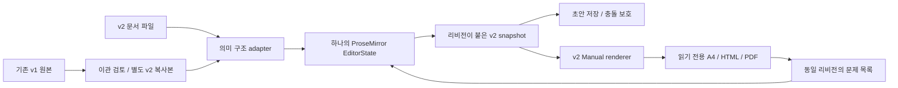

# Manual 편집기 재설계

- 상태: **노션 수준의 기본 문서 편집으로 확장 중 / 전체 수락 미완료**, 2026-10-07. 현재 목표와 증거는 [§14](#14-노션-기본-편집-목표와-수락--2026-10-07)를 따른다.
- 범위: LDS Manual의 문서 모델, 저작 UI, A4 출력 연결, v1 이관. 현재 제품 계약을 변경하거나 기존 문서를 변환한 기록이 아니다.
- 목적: 처음 쓰는 사람이 본문·절차·이미지를 작성하고, 문서를 잃지 않고 수정하며, 실제 A4 출력을 확인할 수 있게 한다.
- 현재 계약: [문서 형식 v1](../document-format.md), [기존 편집 모델](manual-editor-model-contract.md), [저장 계약](../manual-editor-storage.md). 재현 근거는 [UI 감사](manual-editor-ui-audit.md).
- 이후 문서 역할: 이 문서는 다음 구현의 설계 제안, 기존 실행 계획은 구현 이력, UI 감사는 수락 결함 목록이다. 구현·수락 전에는 이 제안을 현행 API로 인용하지 않는다. 구현 후 확정 내용은 durable 계약으로 승격하고 이 문서는 이관 판단 근거로 보관한다.

## 1. 제품 방향과 실패 원인

**문서를 쓰는 화면은 한 편집기로 만든다.** 2026-10-07 사용자 지시에 따라 별도 A4 미리보기 모드와 전환 버튼은 제거한다. 출력은 파일 메뉴의 인쇄 / PDF로 연결한다. 아래 §3의 이전 모드 와이어프레임과 전환 기록은 설계 이력이며 현행 화면 기준은 §14다. 작성 중 문단마다 별도 입력칸을 동기화하지 않는다.

코드에서 확인한 문제:

| 현재 구조 | 결과 | 결정 |
|---|---|---|
| `manualField → manualString`, 모든 문자열 isolating, marks 금지 | 문서보다 JSON 속성 폼에 가까움. 문단 간 선택/병합과 부분 서식에 부적합 | 의미 있는 paragraph/list/step 노드와 inline mark로 교체 |
| iframe에 contenteditable을 따로 붙여 PM으로 postMessage | DOM 입력과 PM selection/history 사이를 수작업으로 동기화. 포커스·IME·undo·드래그 보정 누적 | 작성에는 하나의 EditorView와 contentDOM 사용. iframe은 읽기 전용 출력용 |
| 주소를 별도 타입으로 정의 | 내용의 종류를 서식 기능으로 분류 | 일반 텍스트와 링크/강조로 표현 |
| columns를 내용 추가 메뉴에 노출 | 사용자가 내용보다 내부 레이아웃 구조를 먼저 결정 | 내용 묶음의 배치 속성으로 제공 |
| 수정 중 빈 값에도 출판용 nonempty 검사 적용 | 작성 중인 정상적인 빈 상태가 오류로 보임 | 구조 검사, 저작 안내, 출력 차단을 분리 |
| 모델 테스트 후 UI 완성으로 보고 | 손잡이 겹침·과한 크기·낯선 조작을 발견하지 못함 | 모델, 실제 조작, 시각 수락을 각각 통과해야 기본 경로로 전환 |

유지: 기존 Tiptap/PM runtime, 단일 history 원칙, 자산 바이트/crop, host 인증·충돌 보호, 출력 job/revision 연결, LDS Core/Theme와 A4 매체 규칙.
교체: JSON 필드를 그대로 옮긴 편집 schema, iframe 직접 편집 bridge, DOM 좌표만으로 편집 대상과 선택을 추적하는 방식.
보강: 저장 payload의 schema version 구분, 안정적인 객체 ID, inline 렌더링, v2 저장/출력 검증. 기존 host/renderer를 수정 없이 v2에 재사용할 수 있다고 가정하지 않는다.

## 2. 내용·서식·배치의 분류

| 사용자 기능 | 모델의 책임 | 사용 방법 |
|---|---|---|
| 본문, 소제목 | 문단과 제목의 의미 | 바로 입력, 문단 종류 전환 |
| 글머리/번호 목록 | 순서·항목 경계 | 문단을 목록으로 전환, Enter로 다음 항목 |
| 인용 | 다른 문구를 인용하는 의미 | 문단/선택한 문단을 인용으로 전환 |
| 이미지, 표 | 자체 자산/행열 구조 | 삽입 메뉴, 이미지 paste/drop |
| 절차 | 순서가 있는 행동과 그 설명·그림 | 절차 삽입, 제목→설명→다음 단계 |
| 안내 | 제목과 보충 내용, 의미에 맞는 tone | 안내 삽입 후 종류 선택; 위험이 없는 내용은 기본 signal |
| 주소, 파일명, 식별자 | 별도 블록 없음 | 본문에 입력. 자동으로 다른 타입으로 바꾸지 않음 |
| 강조, 링크, 코드 | inline mark | 글자 선택 후 서식 도구 또는 단축키 |
| 이미지와 설명 나란히 | 같은 내용 묶음의 layout | 묶음을 선택하고 세로/나란히 변경 |

초기 inline 서식은 굵게, 기울임, 링크, 코드였으며 현재 목표에서는 **밑줄·취소선**까지 확장한다. 임의 글꼴·글자 크기·색상·절대 좌표는 제공하지 않는다. 제목/본문/캡션의 시각 역할은 LDS 매체 규칙이 정한다. 사용자에게 주소, help, columns, JSON 필드명 같은 내부 분류를 고르게 하지 않는다.

이미지와 설명 묶음은 의미상 함께 움직여야 하므로 구조 자체를 없애지 않는다. 내부에는 `mediaGroup` 컨테이너를 두고, UI에서는 선택한 이미지와 인접한 설명을 ‘함께 묶기’로 만든다. layout만 `stacked / sideBySide`로 바꾼다. 임의 중첩 다단 편집기는 만들지 않는다.

## 3. 작성 화면과 버튼

아래 와이어프레임과 연속 작성 설명은 2026-10-06 초기안이다. 이후 사용자 결정에 따른
단일 작성 화면·파일 인쇄·작성부터 고정 A4와 자동 넘김·상단 `+`·편집 위치 푸터의
현행 기준은 [§14](#14-노션-기본-편집-목표와-수락--2026-10-07)와
[최신 UI 감사](manual-editor-ui-audit.md#현재-읽을-기준--2026-10-07)를 따른다.

```text
┌ 문서 이름 · 저장 상태 ───────────── [작성 | A4 미리보기] [저장] [파일 ▾] ┐
├ 목차(접기 가능) ┬ [되돌리기][다시하기] [본문 ▾] [B][I][링크] [삽입 ▾] ┤
│ 표지           │                                                    │
│ 시작하기       │   시작하기                                         │
│ 작업 실행      │   여기를 눌러 바로 내용을 작성합니다.                │
│                │ ⋮⋮ 현재 문단에만 나타나는 이동 손잡이                │
│                │                                                    │
│ [+ 페이지]     │   1. 단계 제목                                      │
│                │      설명과 화면을 함께 작성합니다.                  │
├────────────────┴────────────────────────────────────────────────────┤
│ 저장 위치 · 필요한 경우에만 문제/저장 실패 알림                         │
└─────────────────────────────────────────────────────────────────────┘
```

- 상단은 문서 수준 행동, 도구 줄은 선택한 내용 수준 행동이다. 같은 명령을 여러 줄에서 반복하지 않는다.
- 신규 빈 문서는 페이지 제목과 빈 본문으로 시작한다. 샘플 문구를 실제 데이터로 채우지 않는다. 별도 예제 열기를 제공한다.
- 본문 폭은 읽기 가능한 폭으로 제한한다. A4를 화면에 맞춰 계속 축소하지 않는다. 문단은 이어서 입력할 수 있고 긴 페이지는 아래로 늘어난다.
- 첫 버전은 **명시적인 페이지 구분을 유지**한다. 작성 화면의 페이지는 논리적 묶음이며 높이 제한이 없다. 내용이 자동으로 다음 A4 페이지로 흘러간다고 설명하지 않는다.
- 목차는 페이지/소제목 중심이며 전체 데이터 트리를 펼치지 않는다. 페이지 선택은 이동만 한다. 제목 변경은 제목에서 직접 한다.
- 오른쪽 속성은 기본적으로 닫는다. 이미지의 대체 텍스트/crop/폭, 표의 열 구성, 안내 종류, 묶음 배치처럼 본문에서 직접 처리하기 어려운 설정에만 사용한다. 본문 텍스트를 오른쪽에 중복 편집하지 않는다.
- 삽입 위치는 현재 caret 뒤, 선택한 블록 뒤 순으로 결정한다. 둘 다 없으면 마지막 편집 위치로 돌아가고 위치를 표시한다. 임의로 페이지 끝에 넣지 않는다.
- 기본 삽입 경로는 도구 줄 하나다. FAB를 동시에 두지 않는다. `/` 메뉴는 선택적 후속 기능이며 초기 발견 가능성을 대신하지 않는다.
- 링크 입력은 주소 입력창을 연다. 타이핑 중 링크 클릭은 편집에 머물고, 명시적인 ‘열기’로 이동한다.

### 좁은 화면

목차는 접고 작성 영역 폭을 확보한다. 첫 줄에 문서 이름/저장 상태/메뉴, 다음 줄에 작성/A4 보기와 최소 도구를 둔다. 가려지는 서식은 더보기에서 접근한다. 속성은 닫기 가능한 시트로 열고 문서 선택과 스크롤을 보존한다. 390px에서도 본문 글자를 축소하지 않는다.

### A4 미리보기

```text
[작성으로 돌아가기]   2 / 5쪽 · 80%       [검토할 항목 2] [인쇄 / PDF]
                     ┌───────────┐
                     │ 실제 A4   │   넘침/누락 → 위치 보기 → 작성으로 복귀
                     │ 출력 결과 │
                     └───────────┘
```

A4 화면에는 caret·편집 손잡이·삽입 FAB가 없다. 실제 폰트/이미지 로딩 후 동일 리비전의 출력 배치를 검사한다. 문제를 선택하면 작성 화면의 해당 객체로 이동한다. 변경 후 오래된 출력에는 리비전 차이를 표시하고 새 결과가 준비됐다고 오인시키지 않는다.

## 4. 기본 편집과 드래그 계약

- 하나의 PM selection, composition, history를 사용한다. DOM에 별도 undo나 텍스트 모델을 만들지 않는다.
- 본문 Enter는 선택 범위를 교체하고 문단을 분리, Shift+Enter는 hardBreak, 문단 앞 Backspace는 허용된 같은 컨테이너의 앞 문단과 병합한다. 빈 목록 항목 Enter는 목록 종료다.
- 여러 문단 선택/복사/잘라내기/붙여넣기/삭제/undo가 하나의 편집기에서 동작해야 한다. 페이지 경계를 지나는 범위 삭제는 내용만 지우고 페이지 컨테이너는 남긴다. 페이지 자체 삭제는 별도 명령이다.
- 이미지/표/절차처럼 구조가 있는 내용은 node selection과 내용 선택을 구분한다. 이미지가 든 단계를 Backspace 한 번으로 조용히 통째로 삭제하지 않는다. 경계에서는 먼저 전체 선택 상태를 보여주고 재삭제 또는 명시적 삭제로 제거한다.
- 단계 제목 Enter는 설명 시작으로 이동한다. 설명에서는 일반 문단 규칙을 쓰고 마지막 빈 설명 문단의 Enter로 다음 단계를 만든다. ‘다음 단계 추가’도 문맥 메뉴에서 제공한다. 설명 중간 Enter가 새 행동을 만들지 않도록 한다.
- 표 셀은 inline/hardBreak를 지원하고 Tab은 다음 셀로 이동한다. 마지막 셀 Tab의 행 추가는 명시적인 undo 한 번으로 복원한다. 병합 셀은 첫 버전에서 제외한다.
- 붙여넣기는 허용된 문단·목록·inline 서식만 보존한다. 미지원 스타일 제거 여부를 알리고 일반 텍스트 붙여넣기를 제공한다. 원시 HTML을 저장하거나 실행하지 않는다.

손잡이는 hover/focus 대상 한 개에만 제공한다. 본문 요소를 먼저 거치지 않아도 옆 손잡이 열(gutter)에 진입하면 포인터 높이에 해당하는 요소의 손잡이가 나타나야 한다. gutter를 따라 위아래로 이동하면 대상이 바뀌며, 본문과 손잡이 사이에서는 사라지지 않는다. 중첩 요소에서는 해당 위치의 가장 가까운 의미 단위를 선택하고 문서/열 바깥에서는 숨긴다. 문자 glyph에 의존하지 않는 작은 LDS-compatible 아이콘을 쓰고, 첫 줄 기준선과 여백을 맞춘다. 보이는 아이콘과 포인터 영역을 분리하고 텍스트/번호 열을 가리지 않는다. 화면마다 동일 픽셀을 덧대는 방식으로 A4 배율을 보정하지 않는다.

- 기본 이동 대상은 가장 가까운 의미 단위다. 단계 위에서는 그 단계가 대상이다. ‘절차 전체 선택’은 손잡이 메뉴의 명시적 선택으로 제공한다. 부모/자식 손잡이를 동시에 띄우지 않는다.
- 클릭은 문맥 메뉴, 드래그는 이동이다. 메뉴에는 위/아래 이동, 다른 페이지로 이동, 복제, 삭제를 제공한다. 터치/키보드에서도 드래그 없이 같은 작업을 수행할 수 있어야 한다.
- 드래그하는 내용의 요약 또는 제한된 크기의 미리보기와 삽입선을 제공한다. 유효하지 않은 자리와 원래 자리에는 성공 표시를 하지 않는다. 이동 후보 계산과 실제 명령은 같은 제약을 사용한다.
- 이동 대상은 stable ID로 추적하고 drop 때 현재 위치를 다시 계산한다. 입력 직후 정상적인 revision 증가만으로 이동을 실패시키지 않는다. 대상 삭제/다른 문서 열기 등 실제 충돌이면 취소한다.
- Esc/pointer cancel/문서 전환 시 변경 없음. drop은 하나의 transaction이며 undo/redo가 내용·선택을 복원한다. 스크롤 중 손잡이 DOM을 재생성하지 않는다.

## 5. 제안하는 문서 모델 v2

**이 절은 저장 포맷 제안이다. 현재 `schemaVersion:1` 계약을 바꾸지 않는다.** 신규 editor schema를 v1 adapter에 억지로 끼워 넣지 않는다.

```text
ManualDocument(schemaVersion:2, id, title, lang, cover?, pages[], extensions?)
  Page(id, title:Inline[], lead?:Inline[], blocks[], extensions?)
  Block
    paragraph(id, content:Inline[])
    heading(id, level:3, content:Inline[])
    list(id, ordered, start?, items:ListItem[])
      ListItem(id, blocks: paragraph | list)
    quote(id, blocks:paragraph[])
    procedure(id, start, steps:Step[])
      Step(id, title:Inline[], blocks: paragraph | list | quote | figure | callout)
    figure(id, asset, alt, caption:Inline[], widthPreset, crop?, previewTitle?)
    table(id, label, headers:Cell[], rows:Cell[][])
      Cell(id, content:Inline[])
    callout(id, title:Inline[], tone, blocks:paragraph | list)
    mediaGroup(id, layout:stacked|sideBySide, figure:Figure, blocks:paragraph|heading|list|quote|procedure|figure|table|callout)
  Inline = text(text, marks?) | hardBreak
  Mark = strong | emphasis | code | link(href)
```

- cover는 기존 title/logo/metadata/sectionTitle/blocks의 의미를 유지하고 표시 문구에 Inline을 쓴다. 표지 메타의 label/value는 식별 가능한 자식 노드로 유지한다.
- v2 ID는 페이지/블록/단계/목록 항목/셀처럼 이동·참조되는 객체에 둔다. 문자열 run에는 ID를 넣지 않는다. 이동은 ID 유지, 복제는 하위 ID까지 새로 부여, undo는 원래 ID 복원이다.
- ID를 기존 v1 문서에 몰래 주입하지 않는다. ID 생성은 명시적 v2 복사본 이관에서 한 번 수행한다. session caret/hover/DOM 위치는 저장하지 않는다.
- 알려진 타입의 확장 메타데이터는 `extensions`에 보존한다. 편집기가 알 수 없는 메타데이터를 서식 변경으로 삭제하지 않는다. 알 수 없는 타입/버전은 원본 보존·읽기 제한 경로로 처리한다.
- figure의 asset은 현재 상대 자산 경로와 바이트 참조를 유지한다. crop의 sourceWidth/sourceHeight와 실제 원본 크기 검증도 유지한다. 파일 경로나 해시를 이미지 설명 대신 표시하지 않는다.
- Inline의 text는 비어 있지 않은 run, 빈 문단은 빈 Inline 배열이다. hardBreak는 명시적 노드다. 텍스트의 Unicode를 정규화하거나 주소를 자동 수정하지 않는다.
- mark 중복/순서는 정규화하되 plain text는 바꾸지 않는다. 링크는 우선 http/https/mailto와 문서 내부 anchor만 허용한다. javascript/data/file 링크, 임의 HTML/style 속성은 저장하지 않는다. 사내 전용 URI 요구는 별도 계약으로 추가한다.
- 단순 문자열 기반의 v1 출력기로 v2를 flatten하지 않는다. v2 renderer가 허용된 mark와 semantic node를 명시적으로 출력해야 한다.

일반 본문 안에서 주소를 강조하는 제안 예시:

```json
{
  "type": "paragraph",
  "id": "block-example-1",
  "content": [
    { "type": "text", "text": "접속 주소: " },
    { "type": "text", "text": "https://example.invalid", "marks": [
      { "type": "strong" },
      { "type": "link", "href": "https://example.invalid" }
    ] }
  ]
}
```

기존 주소 블록 이관은 **강조만 보존**한다. 원래 링크가 아니었던 주소를 이관 중 임의로 클릭 가능한 링크로 바꾸지 않는다. 위 예시는 사용자가 링크를 명시적으로 설정한 신규 문구다.

## 6. 편집기와 출력 구조



PM은 실행 중 문서 내용의 단일 정본이다. 파일 포맷은 Tiptap 버전의 내부 JSON에 직접 종속하지 않는 Manual v2 도메인 포맷이며 저장/불러오기 경계에서 adapter로 변환한다. 변환 대상은 문서의 의미 구조이며 JSON key마다 manualField를 만드는 방식은 폐기한다. 저장 snapshot이나 미리보기는 독립적인 수정 가능한 문서 모델이 아니다.

- document/page/procedure/step 같은 노드를 schema의 실제 content expression으로 정의한다. text는 inline 노드, 강조·링크는 marks다. editable content는 NodeView의 contentDOM에서 PM이 관리한다.
- 편집 도구와 이미지 제어는 non-editable 영역으로 분리한다. 별도의 contenteditable에 입력을 받아 다시 PM에 전달하지 않는다.
- 내부 이동/삽입/서식/속성 수정은 모두 같은 EditorState transaction에 들어간다. 보존용 opaque metadata는 attrs 또는 ID-keyed envelope로 관리하며 drop/복제/삭제의 lifecycle을 명시한다.
- 테이블 등 구조적 노드에만 필요한 선택 경계를 둔다. 모든 문자열에 isolating을 넣어 정상적인 텍스트 이동을 막지 않는다.
- Core Callout/Blockquote는 공개 API를 사용한다. 공개 API만으로 contentDOM 배치가 불가능하면 렌더러 내부를 복제/스타일 덮어쓰기 하지 않고 편집 전용 의미 표현을 사용한 뒤 출력에서 정식 Core를 적용한다. 어느 부분의 외형이 출력과 다른지 미리보기로 확인할 수 있게 한다.
- 현재 runtime은 유지한다. StarterKit이나 다른 history를 중복 등록하지 않는다. 설치되지 않은 extension/package가 필요하면 dependency 변경을 별도 검토하며 이 설계 단계에서 설치하지 않는다.
- `preview-main.jsx`는 read-only renderer로 축소한다. 기존 `canvas-input.mjs`, `direct-edit.mjs`, DOM path 기반 drag bridge는 v2 기본 경로에서 제거한다. v1 복구용 경로는 검증 완료 전까지 격리해 유지한다.

## 7. 페이지와 출력의 정합성

첫 버전은 자동 페이지 나눔 엔진을 만들지 않는다. 문서의 명시적 page 순서와 배치를 유지하면서 작성 화면만 연속적으로 편집한다. A4 검토에서 넘친 페이지를 식별하고 ‘이 블록부터 다음 페이지로’ 또는 ‘이 단계부터 다음 페이지로’로 분리한다. 이 동작은 한 번의 undo로 복원한다.

- 출력 typography/210×297mm/13mm 여백 등 현행 매체 규칙을 보존한다. 넘침을 숨기거나 글자 크기를 줄여 통과시키지 않는다.
- 단계 분리는 procedure start를 유지/계산하며 사용자가 변경된 번호를 확인할 수 있어야 한다. 그림·설명은 단계와 함께 이동한다.
- 표는 행 경계 분리만 허용한다. 반복 헤더와 동일 열 수를 보존한다. 한 행 또는 한 블록 자체가 페이지보다 크면 수동 재구성을 안내한다.
- 이미지 누락/해석 불가/crop 오류는 해당 객체 ID로 위치를 연결한다. 렌더링 실패 시 이전 유효 출력은 남기되 ‘현재 문서 출력’으로 표시하지 않는다.
- 미리보기 생성에는 document revision, renderer version, 자산 digest를 포함한다. 느린 이전 작업이 최신 결과를 덮지 못하게 한다. 검토·출력 기록도 이 식별에 연결한다.

## 8. 저장·검증·복구

| 단계 | 허용/검사 | 사용자 표시 |
|---|---|---|
| 편집 구조 | 타입/노드 중첩/ID 유일성/mark 안전성 | 손상 또는 지원하지 않는 형식만 편집 진입 차단 |
| 초안 | 빈 제목/문단/페이지/단계, 선택 자산 미완료 허용 | 저장 가능. 빈 입력칸마다 빨간 오류를 붙이지 않음 |
| 저작 점검 | 제목·대체 텍스트·의미·문맥 누락 | 대상별 할 일. 전체 오류를 한 번에 모아 표시 |
| 출력 준비 | 필수 내용, 이미지/crop, A4 넘침 | 초안 PDF/배포용 출력에 필요한 차단 항목을 각각 명시 |
| 검토 후 출력 | 현재 리비전의 copy/layout/visual review | 오래된 검토를 새 승인으로 승계하지 않음 |

초기 v2에서도 저장 정책을 모드별로 갑자기 바꾸지 않는다. **저장 버튼과 Ctrl/Cmd+S는 미완성 내용을 보존**한다. 폴더 모드에서는 v2 작업 초안을 저장하고, 유효 정본 반영은 별도의 검증된 작업으로 명확히 표시한다. 기존 v1 `/api/save`의 valid-only 의미를 초안 저장으로 몰래 바꾸지 않는다. v2 payload/작업 초안/정본 promotion을 구분하는 host 계약을 먼저 정하고 capability negotiation으로 지원 여부를 검사한다.

브라우저 모드와 host 모두 저장 중/성공/실패/다른 곳에서 변경됨을 보여준다. 새 문서/열기 시 미저장 변경은 저장·버리기·취소로 처리한다. 조용히 자동 저장하거나 실패 후 문서를 바꾸지 않는다. 외부 수정/동시 탭에는 compare-and-swap revision을 적용하며 충돌 복사본/원본 재읽기/다운로드를 제공한다. 이미지를 포함한 이식 파일을 내려받아 복구할 수 있어야 한다.

## 9. v1 이관 매핑과 보호

| v1 | v2 제안 | 보존/주의 |
|---|---|---|
| paragraph.text | paragraph.content | 줄바꿈은 hardBreak, 문자 원문 유지 |
| subheading.text | heading(level 3) | 의미와 출력 위계 유지 |
| address.value | strong mark의 paragraph | 자동 링크 추가 없음. 기존 크기/색 차이는 이관 비교에서 명시 |
| 문자열/label-value 혼합 list | listItem의 paragraph들 | label/value·콜론·강조를 보존. 원래 역할/optional 플래그는 이관 provenance에 남김 |
| quote.text | quote의 paragraph | 기존 renderer의 줄 단위 문단과 빈 줄 처리 차이를 fixture로 고정; 원래 원문도 보존 |
| steps | procedure/step | title, text, quote, figure의 순서와 start, crop/원본 그대로 유지 |
| callout/help | callout | help는 alias로 정규화. tone 원래 값 보존 |
| figure | figure | src/alt/caption/size/previewTitle/crop 보존 |
| columns | mediaGroup(sideBySide) | 기존 figure+blocks 관계 유지. 단순 flatten 금지 |
| table | table/Cell | label, 헤더, 행/열, 문자 원문 보존 |
| cover/page/metadata | 동일 의미의 v2 컨테이너 | 제목과 문서 제목을 강제 동기화하지 않음 |

이관은 원본 v1 바이트와 sidecar/asset manifest를 별도 보관한 **새 v2 복사본**에 수행한다. source hash, v1 path→v2 ID, 변환 규칙 버전, 시각 차이, unknown 필드 보관 위치를 manifest에 남긴다. 알려진 노드의 모르는 필드는 namespaced legacy metadata로 보존한다. 모르는 block/schema는 추정 변환하지 않고 원본 보관과 읽기 제한을 제공한다.

원본 백업 보존은 v2→v1 무손실 역변환 보장이 아니다. v2의 inline 서식/새 구조는 v1로 표현할 수 없으므로 v1 export는 표현 가능한 문서만 허용하고, 손실이 있으면 항목을 알리고 중단한다. 기존 검토 파일은 원본 증거로 보관하되 새 v2 리비전의 검토 완료로 인정하지 않는다.

## 10. 구현 순서와 전환 gate

| 순서 | 구현 범위 | 다음 단계 진입 조건 |
|---|---|---|
| 1. 입력 기반 시험 | 한 EditorView에 본문·heading·list·marks, 빈 문서/복수 문단 입력 | 실제 한글 IME, 범위 선택, paste, undo/redo를 브라우저에서 통과. A4 꾸미기부터 시작하지 않음 |
| 2. 의미 모델/adapter | v2 IDs/Inline/확장 메타/초안 validator, v1 복사본 이관 | 모든 shipped fixture 및 unknown·absent/empty 보존 검사, 변환 차이 리포트 |
| 3. 매뉴얼 저작 | 절차·그림·표·안내·mediaGroup와 단일 history | 단위별 생성/수정/삭제/이동·범위 선택 및 자산 복구의 실제 조작 |
| 4. 출력/저장 계약 | v2 renderer, v2 host capability와 초안/정본 구분, CAS, 독립 출력 | 해당 계약 변경의 전체 검증과 v1 회귀, HTML/PDF 정합성 |
| 5. 화면과 수락 | 위 와이어프레임, 한 개의 문맥 손잡이, 좁은 화면 | 아래 시각/사용성 수락 후에만 기존 기본 진입점 대체 |

단계 1에서는 배포용 새 포맷을 저장하지 않고 입력 기반을 먼저 검증한다. 각 구현은 다음 범위가 준비되지 않으면 기존 사용 문서를 새 경로로 열지 않는다. 공개 API/schema/저장 계약 변경 단계는 빠른 검사만으로 마감하지 않고 workspace 검증 정책의 전체 경로로 승격한다. UI 소규모 수정 단계와 구분한다.

### 수락 시나리오

1. 빈 문서에서 제목→본문→목록→절차→그림을 키보드와 삽입 메뉴로 작성한다. 안내 문구가 실제 데이터에 들어가지 않는다.
2. 한국어 조합 중 Enter/방향키/undo/저장, emoji/줄바꿈/긴 URL, 두 문단 이상 선택 대체를 실제 입력기로 검사한다.
3. 단계 제목과 설명을 여러 문단으로 작성하고 그림을 붙인 뒤 다른 페이지로 옮긴다. 번호·자산·선택이 보존되고 undo 한 번으로 복원된다.
4. 손잡이가 없는 기본 화면, hover, focus, 드래그, 취소, 삽입 후보 없음의 화면을 각각 캡처한다. 첫 줄 정렬, 부모/자식 충돌 없음, 손잡이까지 이동하는 포인터 경로를 확인한다.
5. 1280×720/760×740/390×844와 200% 확대에서 작성/목차/속성/오류/출력 보기. 본문 가독성, 도구 접근, focus와 scroll 복귀를 확인한다.
6. A4 넘침, 깨진 그림, 빈 페이지, 긴 제목, 10열·24행 표, 마지막 블록/단계 삭제. 각 문제에서 수정 위치로 이동하고 유효 출력까지 복구한다.
7. 저장 실패·동시 탭·host 409/만료/네트워크 단절·저장 중 문서 전환·새로고침. 원본과 미저장 편집을 잃지 않는다.
8. v1 원본을 복사본 이관하고 이전/이후 HTML/PDF를 비교한다. 내용·읽기 순서·번호·강조·자산을 확인하고 주소 서체 등 의도한 차이를 별도로 기록한다.

**완료 증거:** exact source/build와 연결된 모델/host 결과 + 실제 조작 기록 + 화면 캡처 + 독립 출력 비교. 노드 테스트 수, 빌드 성공, HTTP 200은 시각 수락을 대신하지 않는다. 브라우저 도구가 차단되면 그 gate는 미완료로 남기고, 외형을 추측해 반복 반영하는 것을 완료 경로로 삼지 않는다.

## 11. 참고와 적용 범위

- [Tiptap schema](https://tiptap.dev/docs/editor/core-concepts/schema): block/inline/mark와 content expression을 구분하는 구조를 참고했다.
- [Tiptap NodeView](https://tiptap.dev/docs/editor/extensions/custom-extensions/node-views/javascript): editable content를 contentDOM으로 editor에 연결하는 경계를 참고했다.
- [BlockNote Side Menu](https://www.blocknotejs.org/docs/react/components/side-menu): hover 대상의 문맥 도구와 손잡이 메뉴를 참고했다.
- [Notion writing/editing](https://www.notion.com/help/writing-and-editing-basics): 블록 조작과 본문 작성의 사용자 단위를 참고했다.

공식 문서의 동작 설명을 참고한 것이며 외부 제품을 실제로 조작하거나 동일 품질을 달성했다는 뜻이 아니다. 이번 결정은 Manual의 저작/출력 분리와 기존 자료 보존을 위한 설계 판단이다. 새 라이브러리 도입, 공통 Core/Theme 변경, 자동 페이지 나눔, 공동 편집, 클라우드 게시, 기존 원본 덮어쓰기는 이번 설계 구현 범위에 포함하지 않는다.

## 12. 병렬 작업과 결정 기록 — 2026-10-06

사용자가 기존 형제 세션 세 곳의 상호 메시지·병렬 작업과 논의 내용 문서화를 요청했다. 이 절을 공동 작업의 결정 기록으로 유지한다. 담당 배정, 상대 확인, 구현, 검증 완료를 별개 상태로 기록하며 메시지를 보낸 것만으로 합의 또는 완료로 표시하지 않는다.

**최신 상태:** 독립 프로토타입 구현, 모델 26/26, 최종 빌드 및 아래 보고된 브라우저 조작 검증 완료. 실제 OS IME·외부 앱 clipboard·200% 확대·touch 실기는 미검증이다. 단계 1 전체 수락과 기본 에디터 전환 gate는 통과하지 않았다. 아래 중간 보고의 대기 상태는 기록 당시 상태이며 최종 통합 결과를 우선한다.

### 담당 범위

| 세션 | 담당 / 파일 소유 범위 | 현재 상태 |
|---|---|---|
| Pull 전체 LDS 원격 변경 | 진행 중 v1 포커스 검증 마무리, 이후 별도 입력 프로토타입 UI. `apps/editor/src/redesign/PrototypeEditor.jsx`, `prototype.css`, 독립 진입점 및 필요한 최소 빌드 설정. dist 빌드는 이 세션에서만 실행 | UI 구현·최종 build·보고 범위 실기 완료 |
| Pull 전체 LDS 원격 변경 (2) | 단일 EditorView 커널. `apps/editor/src/redesign/prototype-kernel.mjs`, `apps/editor/tests/redesign-prototype.test.mjs` | 전체 선택 보완 및 모델 검사 26/26 통과, UI 통합 확인 |
| Pull 전체 LDS 원격 변경 (3) | 조정, 본 문서의 결정·수락 기록, 통합 결과 확인. 위 UI/커널 파일 직접 수정 안 함 | 합의·검증 기록 및 source hash 대조 완료 |

세션 식별자: 기본 `01a10fdc-3af8-7e10-8c53-8fe95833e5db`, (2) `01a1114d-eebb-72b0-80a8-3688680b4092`, (3) `01a1114e-0ef3-77a1-83f9-b98a7e2c3517`.

공유 checkout의 기존 미커밋 변경은 각 세션 작업을 포함한다. 파일 소유 범위를 넘는 수정은 먼저 담당자와 합의한다. 재설계 문서는 (3)이 단일 작성자로 유지하고 다른 세션은 결정 근거와 증거를 메시지로 전달한다. 기존 감사 문서의 담당 검증 기록은 해당 세션이 갱신할 수 있다.

### 결정과 보류

| ID | 결정 또는 제안 | 이유 / 제외한 대안 | 상태 |
|---|---|---|---|
| P-01 | 기본 v1 경로와 분리한 입력 프로토타입부터 구현 | 기존 작성물을 실험 모델로 열거나 저장하지 않으며, 입력 기반을 확인하기 전에 기본 에디터를 교체하지 않음 | 작업 지시 전달 |
| P-02 | 기존 PM runtime, 하나의 EditorState/history, 새 dependency 없음 | 별도 DOM 입력 bridge와 중복 history를 재도입하지 않음 | 설계 기준 |
| P-03 | `createPrototypeState({doc?}={})` → EditorState, `createPrototypeView(element,{doc?,onChange?}={})` → EditorView | UI/커널 담당 간 합의 보고 수신. `onChange(state,view)`는 selection을 포함한 transaction 이후 통지. doc는 실험 PM JSON이며 저장 포맷이 아님 | 커널 구현 보고, UI 통합 대기 |
| P-04 | 프로토타입은 저장 없음과 실험 상태를 명시 | 저장 기능처럼 보이는 버튼이나 v2 정본 저장을 먼저 붙이지 않음 | 작업 지시 전달 |
| P-05 | 모델 테스트, 실제 조작, 시각 검증을 분리 기록 | build/HTTP 성공을 실제 한글 IME·선택·배치 검증으로 대체하지 않음 | 수락 기준 |
| P-06 | 문서에서 상태를 확인 가능한 증거와 함께 갱신 | 세션 메시지에서만 합의가 남거나 중간 제안이 현행 계약으로 보이는 문제 방지 | 적용 중 |

### 단계 1 인수 항목

| 항목 | 필요한 증거 | 현재 상태 |
|---|---|---|
| 의미 노드와 부분 서식 | 빈 문단, 제목, 목록, strong/emphasis/link/code, hardBreak의 커널 검사 | 담당자 모델 검사 통과 보고 |
| 단일 history | 입력·서식·목록 전환 undo/redo와 선택 복원의 테스트 | 담당자 모델 검사 통과 보고 |
| UI 명령 | 문서가 실제 빈 상태로 시작, 명령 활성/비활성, 키보드 포커스와 선택 유지 | 아래 최종 보고 범위 확인, 전체 키보드 수락은 별도 |
| 일반 입력 | 복수 문단 선택·교체, 목록 Enter/Backspace, paste의 실제 브라우저 조작 | 아래 실제 조작 경로 통과 보고 |
| 한국어 조합 | 실제 OS IME로 조합·확정·Enter·방향키·undo 확인. 자동 문자열 삽입은 대체 증거 아님 | 미검증 |
| 화면 배치 | 넓은/좁은 화면, 확대 상태에서 텍스트와 툴바 접근성 확인 및 캡처 | 1280/390 폭 확인, 200% 확대 미검증 |
| 기존 경로 격리 | 기본 URL 유지, 별도 프로토타입 URL, 기존 데이터/저장 API 미사용 확인 | 기본 / 유지, 별도 URL 및 비저장 동작 확인 보고 |

검증 보고에는 실행 명령, source/build 식별 근거, 결과, 증거 경로, 미검증 항목을 함께 남긴다. 접근 제한이 있는 도구는 우회하지 않으며 해당 검증을 미완료로 기록한다. 새 결정은 이유와 영향 범위를 이 절에 추가하고, 완료된 설계만 현행 계약으로 승격한다.

### 담당자 확인과 후속 논의

- UI 담당은 v1 포커스 개선 마무리와 지정된 독립 프로토타입 작업 인수를 확인했다. v1 컨트롤러 6/6 및 build 통과, 실제 브라우저의 선택/Enter/Esc/Delete/undo와 focus-only Delete 무변경을 보고했다. 이는 담당자의 v1 검증 보고이며 새 프로토타입이나 실제 OS IME 수락 증거로 승계하지 않는다. 세부 증거는 [UI 감사](manual-editor-ui-audit.md)의 해당 기록을 따른다.
- 독립 진입점 `http://127.0.0.1:44589/prototype.html` 구현 및 1차 build 성공을 UI 담당이 보고했다. 기본 `/` 경로는 유지한다.
- 커널 담당은 `prototypeSchema`, `prototypeCommands`, `setHeading(level)`, `setLink(href|null)` export를 전달했다. 명령은 PM의 `(state, dispatch?, view?)` 계약을 따른다. 툴바가 조합 중 입력을 훼손하지 않도록 `view.composing`일 때 거절한다. 명령 목록은 paragraph/heading/bulletList/orderedList/strong/emphasis/code/undo/redo/hardBreak/enter/backspace다.
- **확정:** 커널 초안 heading 기본 level 2를 §5와 같은 level 3으로 조정했다. 커널 담당이 schema default 및 heading 명령 반영을 보고했다. UI 담당에게도 전달했다.
- 커널 담당 완료 보고: 실제 PM EditorState를 사용하는 모델 검사 **17/17 통과**. 빈 문서, Enter 시작/중간/끝/선택, Backspace/Delete 병합, 다중 문단 선택 대체와 선택 복원, 전체 삭제 후 빈 본문, hardBreak, heading/marks history, 목록 분리·빈 항목 종료·종류 전환, 링크 scheme 차단, 구조 검사, composing guard/dry-run을 포함한다. 동일 source의 검사는 중복 실행하지 않는다. 재현 명령과 source hash는 담당자에게 요청했다.
- 이 결과는 **모델 계층 검사**다. 실제 OS IME, DOM selection, HTML clipboard, UI 연결, 화면 배치 검증은 통과로 간주하지 않는다. 커널 담당은 지정 두 파일만 생성했고 기존 v1/서버/dist를 수정하지 않았다고 보고했다.

### 독립 UI 1차 통합 보고

UI 담당은 JSX/CSS/진입점 및 Vite entry를 추가하고 Core Button/Theme를 사용했다고 보고했다. 최소 도구는 문단 종류, 굵게/기울임, undo/redo다. 실험 화면·저장 없음 고지, 새로고침/이탈 경고, Ctrl+S 비저장 안내를 포함한다.

- 실제 브라우저 보고: 한국어+emoji 텍스트 paste, h3 전환, 두 문단 선택 후 툴바 strong의 선택 보존, 다중 문단 대체 후 undo/선택 복원, 번호 목록의 빈 항목 Enter 종료 통과.
- 1280×720 및 390×844 확인. 증거: [넓은 화면](assets/manual-editor-ui-audit/prototype-desktop.jpg), [모바일 화면](assets/manual-editor-ui-audit/prototype-mobile.jpg). 담당자의 1차 화면 검증이며 최종 수정 이후 수락과 구분한다.
- **커널 보완 완료 / UI 검증 대기:** 목록→본문/소제목을 하나의 transaction으로 전환하도록 보완했다. 최종 build/영향 검증 결과를 기다린다. 이전 17/17은 보완 전 커널의 검사 결과이며 최신 모델 근거는 아래 22/22다.
- **미완료:** 실제 OS 한글 IME, HTML clipboard의 서식 보존/제거, 200% 확대 및 최종 source/build 식별 증거. 한국어 문자열 paste가 실제 조합 입력의 검증을 대신하지 않는다.

현재 상태는 독립 입력 프로토타입의 1차 통합이다. 기본 에디터 전환, v2 파일 저장, 이관 또는 A4 출력 완료로 해석하지 않는다.

### 목록 전환 보완과 최신 커널 검증

UI 연결 과정에서 발견한 목록→본문/소제목 동작을 커널에서 보완했다. 선택된 비중첩 목록의 단일 항목 또는 복수 형제 항목을 목록 밖의 본문/h3로 전환한다. 전체 전환은 한 transaction이며 undo로 내용과 원래 선택을 복원한다.

**현재 제한:** 중첩 목록, 하위 목록을 가진 부모 항목, 혼합 컨테이너 선택은 dry-run/실행 모두 false다. UI는 이 조건에서 명령이 실행 가능한 것처럼 표시하지 않아야 한다. 복잡한 선택의 변환을 임의로 flatten하는 대신 범위를 제한한 것이며, 전체 목록 편집 기능의 수락 완료를 뜻하지 않는다.

커널 담당 보고: `PATH=/home/jinhyuk2me/.local/node/bin:$PATH node --test apps/editor/tests/redesign-prototype.test.mjs`를 repo root에서 실행해 **22/22 통과**. 조정 담당은 아래 source SHA256이 현재 파일과 일치함을 확인했다. 같은 source의 모델 검사를 중복 실행하지 않았다.

| 파일 | SHA256 |
|---|---|
| `apps/editor/src/redesign/prototype-kernel.mjs` | `1543315747a6ec98e95a6683930a33b7bdd371340105b7c11697392cb3b99b86` |
| `apps/editor/tests/redesign-prototype.test.mjs` | `612356d82cc385b7416abc8154ff485f9083876afa7a1de351d838112efaf329` |

UI 담당에게 최종 build와 변경된 전환 동작, 미지원 선택의 비활성 표시 검증을 전달했다. 실제 OS IME와 최종 화면 검증은 별도 gate로 남는다.

### HTML clipboard 제한 검증

UI 담당은 CUA의 HTML paste로 문단 2개와 strong/em/안전한 https 링크를 넣고 실제 편집 DOM에서 보존되는 것을 확인했다고 보고했다. **합성 fixture 1개 통과**로 기록한다. 외부 Word/다른 브라우저의 전체 clipboard 호환, 미지원 스타일 제거 및 악성 HTML 처리의 실제 DOM 검증은 이 결과로 승인하지 않는다. 실제 OS IME와 200% 확대는 여전히 미검증이다.

### 최종 조작 중 발견한 전체 선택 결함 — 커널 수정, 실기 재검증 대기

UI 담당이 두 문단을 Ctrl+A(AllSelection)로 선택하고 번호 목록으로 바꾼 뒤, 남아 있는 AllSelection 때문에 목록 전체를 본문/h3로 전환할 수 없는 경로를 발견했다. **최종 완료 판정을 보류한다.** 앞선 22/22 모델 검사는 이 실제 조작 경로를 보장하지 않았으므로 기존 통과 결과로 결함을 덮지 않는다.

- 커널 담당에게 단일 최상위 목록 전체 선택을 항목 범위로 해석하는 보완과 회귀 검사를 요청했다. 혼합 컨테이너/중첩 목록의 지원 범위를 묵시적으로 넓히지 않는다.
- UI 담당은 전체 목록 선택 시 문단 종류 표시를 보완하고, 실제 혼합 종류는 ‘여러 문단 종류’로 표시하도록 수정 중이다.
- 수락 조건: 두 문단 → Ctrl+A → 번호 목록 → 본문/h3 전환이 실제 화면에서 동작하고, undo가 원래 내용·선택을 복원한다. 커널 변경 이후 해당 경로를 재검증하고 새로운 source/test 근거를 기록한다.

### 전체 선택 회귀 수정 결과

커널 담당은 단일 최상위 목록의 AllSelection을 내부 항목 범위로 해석하도록 수정했다. 전체 선택 → 번호 목록 → 본문/h3/글머리 목록/번호 목록 해제를 지원하고, 실제 변경은 원래 state에서 단일 transaction으로 생성한다. AllSelection을 유지해 undo/redo에서도 전체 선택을 복원한다. 실제 혼합 컨테이너와 중첩 목록 본문 전환의 거절은 유지했다.

담당자 모델 검사 보고: `node --test apps/editor/tests/redesign-prototype.test.mjs` **26/26 통과**(기존 22개와 회귀 4개). 이전 22/22 및 해시는 이전 수정의 근거이며, 최신 모델 근거는 아래와 같다. 조정 담당이 현재 파일 hash 일치를 확인했다.

| 파일 | 최신 SHA256 |
|---|---|
| `apps/editor/src/redesign/prototype-kernel.mjs` | `8f567378f402c64bce40128adf2ab9c74d5f4ad19b7351bf1fff0b4a63eb6796` |
| `apps/editor/tests/redesign-prototype.test.mjs` | `387cb95e1eba986d3d74d69a5fe4963d542e61039ea1e60f0cd9804ed44c00c4` |

최종 build와 실제 전체 선택 전환/undo 경로 재검증은 UI 담당 결과를 기다린다. 모델 회귀 수정만으로 실제 조작 결함의 수락을 완료하지 않는다.

### 최종 통합 결과 — 2026-10-06

UI 담당의 최종 보고를 수신했다. 실행 명령은 `node apps/editor/run.mjs build --runtime ../lk-design-system`이며 build 및 `git diff --check` 통과다. 기본 `/`의 문서는 변경하지 않고 독립 URL `http://127.0.0.1:44589/prototype.html`을 빈 문서 상태로 두었다. 커널 26/26 근거는 동일 source이므로 재사용했다.

실제 조작: **두 문단 paste → Ctrl+A → 번호 목록 → 본문(두 p) → Ctrl+Z(ol과 전체 선택 복원) → 소제목(두 h3)** 통과. 이 경로에서 발견했던 AllSelection 결함은 실기 재검증까지 완료했다. 중첩 목록 전체 선택에서는 본문/소제목 option의 disabled를 DOM으로 확인했다. Ctrl+S는 비저장 안내를 표시하며 네트워크 저장을 하지 않았다.

1280×720/390×844 캡처를 최종 빌드로 갱신했다: [넓은 화면](assets/manual-editor-ui-audit/prototype-desktop.jpg), [모바일 화면](assets/manual-editor-ui-audit/prototype-mobile.jpg). 앞선 한국어/emoji text paste, h3 전환, 두 문단 strong 및 대체 undo, 목록 빈 항목 Enter 종료와 합성 HTML clipboard 결과는 각 검증 범위의 근거로 유지한다.

| 구분 | 최종 식별 근거 |
|---|---|
| JS bundle | `prototype-jyO1Utsr.js` |
| CSS bundle | `prototype-Chd_95T3.css` |
| `PrototypeEditor.jsx` SHA256 | `99867576ebc9ebd70723528bdc3b449fda8b2091aae4f8af8b9efe73baadbbce` |
| `prototype.css` SHA256 | `97e94094bff189c1b3848c314a0ac272d818b3892765d4812ad2e155c06a06c5` |
| 커널 SHA256 | `8f567378f402c64bce40128adf2ab9c74d5f4ad19b7351bf1fff0b4a63eb6796` |

조정 담당은 UI/CSS/커널의 현재 source hash가 위 보고와 일치함을 확인했다. 브라우저 실기는 UI 담당의 보고로 기록하며 조정 담당이 별도 수행한 것으로 표시하지 않는다.

**남은 수락:** 실제 OS 한글 IME, 실제 외부 앱 clipboard 호환, 200% 확대, touch 실기. 따라서 기본 에디터 전환 gate는 미통과이며 저장·v2 이관·출력 완성으로 확대하지 않는다. 이번 분담은 독립 프로토타입의 구현과 명시한 부분 검증까지 완료했다. 원격 push/배포는 수행하지 않았다.

## 13. 실제 저작 흐름으로 작업 재개 — 2026-10-06

사용자는 입력 시험만 만든 뒤 작업을 종료한 점을 지적하고 계속 진행하도록 요청했다. 단계 1의 부분 검증을 전체 작업 완료처럼 마무리한 판단을 수정한다. 실제 OS IME 등 미검증 항목은 기본 경로 전환의 수락 조건으로 유지하되, 독립적인 후속 구현을 중단하는 이유로 삼지 않는다.

| 담당 | 진행 범위 | 파일 소유 |
|---|---|---|
| 기본 세션 | 작성 UI·읽기 전용 A4 보기·이미지 입력·파일/보관함 UI·실기 및 단독 build | `ManualEditor.jsx`, `ManualPreview.jsx`, `manual-editor.css`, `manual-main.jsx`, `manual.html`, Vite entry |
| (2) | 의미 모델·PM adapter·페이지/절차/그림/표/안내의 저작 명령·모델 검사 | `manual-v2.mjs`, `manual-kernel.mjs`, `redesign-manual-model.test.mjs` |
| (3) | v2 문서 파일/브라우저 보관함·CAS·저장 검증·통합 조정과 문서 | `document-store.mjs`, `redesign-document-store.test.mjs`, 본 문서 |

파일은 별도 명시 없으면 `apps/editor/src/redesign/` 아래이며 테스트는 `apps/editor/tests/`다. 기존 v1 데이터/host API를 수정하거나 덮어쓰지 않는다. 새 의존성을 추가하지 않는다.

### 저장과 연결 합의

- `manual-v2.mjs`: `createEmptyManualDocument({title?})`, `validateManualDocument(document)` — 빈 초안 허용, 구조·ID·안전 링크 검사. `manual-kernel.mjs`의 `documentFromState(state)`가 반환하는 도메인 JSON을 저장한다. PM 내부 JSON을 저장 계약으로 사용하지 않는다.
- `document-store.mjs`: `listDocuments`, `loadDocument(id)`, `saveDocument({document,assets,expectedRevision})`, `encodeDocumentFile`, `decodeDocumentFile`.
- 별도 IndexedDB `lds-manual-redesign-v2`만 사용한다. 최초 저장은 expectedRevision:null, 이후 저장은 직전 revision을 제공한다. get/비교/put을 같은 readwrite transaction에서 실행한다. 충돌은 `CONFLICT`, 문서 없음은 `NOT_FOUND`이며 원본을 덮어쓰지 않는다.
- 파일 envelope는 `{format:'lds-manual-document/v2',document,assets}`. assets는 상대 이름→PNG/JPEG/WebP 원본 data URL이다. 문서에는 자산 이름만 참조한다. 파일에는 브라우저 revision을 저장하지 않는다.
- 파일 가져오기의 ID 충돌은 자동 덮어쓰지 않는다. 명시적인 복사본 처리 또는 충돌 안내가 필요하다. 미저장 전환은 저장/버리기/취소다. 초기에는 저장 중 추가 입력을 허용하는 연결을 검토했으나, 통합 리뷰 후 모든 busy 동안 본문을 잠그는 정책으로 결정했다. 저장 snapshot 비교는 늦게 도착한 변경을 위한 추가 보호로 유지한다.
- v1 파일은 기존 에디터에서 열도록 안내한다. source·sidecar·원본 자산·이관 manifest 보존의 전체 계약이 검증되기 전에는 v1 복사본 가져오기 UI를 연결하지 않는다.

### 이번 통합 완료 판단

신규 문서에 페이지·본문·절차·그림·표·안내를 작성하고, 저장·새로고침·보관함 다시 열기·파일 내보내기/가져오기에서 내용과 자산이 보존되어야 한다. 실제 작성과 읽기 전용 미리보기의 차이, 실패 시 복구, 동시 저장 충돌을 검사한다. 아직 없는 기능이나 통과하지 않은 IME/출력 수락을 완료로 표시하지 않는다.

### 저장 모듈 1차 검증

`document-store.mjs`와 `redesign-document-store.test.mjs` 구현. `PATH=/home/jinhyuk2me/.local/node/bin:$PATH node --test apps/editor/tests/redesign-document-store.test.mjs` 결과 **6/6 통과**. 빈 초안/확장 메타/자산의 파일 왕복, 미지원·v1 형식 거절, 자산 경로·데이터 제한, 명시적 최초 revision, stale revision 및 ID 충돌 보호, 잘못된 문서의 기존 저장본 미변경을 검사했다. 실제 IndexedDB와 화면 저장 동작은 이 순수 계약 검사와 별도로 UI 담당이 검증한다.

저장 검사에 중복 ID/위험 링크 파일 거절, 미완성 이미지 슬롯의 초안 왕복을 추가해 **8/8 통과**했다. 현재 구현된 독립 브라우저 저장 계약은 [저장 문서](../manual-editor-storage.md#재설계-에디터의-독립-브라우저-저장-경로)에 기록했다. UI 연결 및 실제 IDB 검증과 구분한다.

### 연결 리뷰에서 발견한 데이터 보존 문제

| 발견 | 조치/합의 | 상태 |
|---|---|---|
| 문단↔소제목 변환 시 기본 PM attrs가 ID/extensions를 초기화할 수 있음 | attrs 보존 변환과 회귀 검사 | 모델 담당 수정·통과 보고 |
| 여러 페이지 범위 삭제가 페이지 컨테이너까지 제거할 수 있음 | 페이지별 내용 삭제와 선택/undo 보존, 직접 DOM 경로는 별도 보호 | 모델 담당 검사 진행 |
| 파일 가져오기에서 문서 ID만 바꾸면 하위 ID/내부 링크의 복사본 의미 불명확 | `copyManualDocument`로 구조 ID 재발급·내부 anchor 재매핑, opaque extensions 유지 | API 제공, UI 연결 진행 |
| 이미지 비동기 읽기 중 문서 전환 | 시작 문서 식별자와 완료 시 현재 문서 비교, 다른 문서에 결과를 넣지 않음 | UI 담당 반영 요청 |
| 이미지 교체 시 이전 crop이 새 원본에 적용됨 | 명시적 optional 속성 삭제 API로 crop 제거, 원본 바이트는 보존 | 양 담당 API 연결 진행 |
| 미리보기 overflow의 페이지 ID가 잘못된 DOM에서 조회됨 | page wrapper의 ID로 수정 위치 연결 | UI 담당 반영 요청 |
| 브라우저 인쇄를 검증된 독립 PDF 출력처럼 노출 | 독립 HTML/PDF 수락 전 해당 완료 주장/버튼 제거 | UI 담당 반영 요청 |

이 항목들은 새 화면의 기본적인 데이터 보존·오류 복구를 위한 연결 검토다. 모델 테스트 통과만으로 실제 화면 수락을 대신하지 않는다.

### 실제 매뉴얼 모델 구현 근거

모델 담당 보고: `PATH=/home/jinhyuk2me/.local/node/bin:$PATH node --test apps/editor/tests/redesign-manual-model.test.mjs` **32/32 통과**. 페이지/절차/그림 caption/표 cell/안내/mediaGroup의 단일 PM 모델, v2 domain 왕복, ID/extensions 보존, 삽입·복제·이동·삭제·undo, 표 Tab 행 추가·Enter 줄바꿈, 전체/부분 다중 페이지 선택 삭제·대체의 page ID 보존, 명시하지 않은 페이지 삭제 거절, 복사본 ID/내부 링크 재매핑, crop 명시 삭제를 포함한다.

| 파일 | SHA256 |
|---|---|
| `manual-v2.mjs` | `ecfb39dee7b7f2f33ed93c9680e82dceb32a15606feb170842403eee8839f3f4` |
| `manual-kernel.mjs` | `379ede1295f476724db933bd791704bd502299002fa99f59ed05c55a6cbb17ec` |
| `redesign-manual-model.test.mjs` | `7b62c161c45add222dce194fc229b1b40332ff950bd77fc86e4aa88be0fc1f06` |

조정 담당이 현재 파일 해시와 일치함을 확인했다. 동일 source 모델 검사는 재실행하지 않았다. 업데이트된 도메인 validator와 저장 모듈의 결합 검사는 **8/8 재통과**했다. 저장 모듈 SHA256은 `a70f8c95b54e0e1d9fa7ded6d935f8c4a4b45624e49cf079a5d37b2e772399db`다.

UI 담당은 복사본 ID 재발급, save mutex, 이미지 비동기 문서 식별 확인과 crop 제거, 링크 입력/해제, code mark, 표지 표시와 오류 위치 연결을 반영했다고 보고했다. 브라우저 인쇄는 **초안**으로 표시하고 검증된 독립 PDF 출력과 구분한다. 실제 브라우저 저장/재열기 및 최종 통합 결과는 다음 보고에서 확인한다.

### 저장 독립 리뷰와 회귀 보완

모델 담당이 저장 모듈을 읽기 전용으로 검토했다. 같은 readwrite transaction의 CAS와 commit 완료 후 성공 통지는 문제를 발견하지 않았다. 다만 IndexedDB open이 blocked로 거절된 뒤 나중에 성공하면 연결이 닫히지 않는 경로를 발견했다. 조정 담당이 늦게 열린 연결을 즉시 닫도록 수정하고 요청 생명주기 회귀 검사를 추가했다. 명시적 assets:null도 빈 자산으로 조용히 바꾸지 않고 거절한다.

저장 최신 검사 **10/10 통과**, source SHA256 `9d1a6292f0554dcc11e2e41ba118648da51dc2c28ef702389e937dceab039250`. 이 중 blocked 테스트는 요청 이벤트를 재현한 단위 검사로, 실제 브라우저 IndexedDB 전체 E2E 증거와 구분한다. UI 담당에게 최종 빌드 반영을 전달했다.

### 네 번째 형제 세션 추가

사용자의 ‘형제 세션 하나 더 만들어줘’ 요청으로 **Pull 전체 LDS 원격 변경 (4)** (`01a11197-0089-7b43-a203-133e75527b46`)를 동일 로컬 프로젝트에 생성했다. 담당은 데이터 유실·비동기 경합·선택/삭제·복구·키보드/좁은 화면의 독립 코드 리뷰다. 기존 파일 소유권은 유지하며 신규 세션은 구현 파일 수정, build/서버 재시작, 사용자 탭 조작을 하지 않는다. 결함과 재현 근거를 조정 세션 및 실제 파일 담당에게 전달하고, 조정 세션이 본 문서에 반영한다.

### 독립 리뷰 1차 결함 — 소스 근거

- **P1 / 수정 필요:** `ManualEditor.jsx`의 비동기 `openRecord`는 busy를 설정하지만 작성 영역 inert 조건이 !ready만 사용해, 저장 문서를 읽는 동안 들어온 입력이 `installRecord`로 덮일 수 있다. 실제 브라우저 재현은 UI 담당 확인 대상으로 전달했다. 문서 교체 대기 동안 편집을 잠그거나 시작 snapshot과 비교해 새 입력을 보존해야 한다.
- **P2 / 수정 필요:** `ManualPreview.jsx`는 객체의 data-*만 출력하고 내부 `#object-id` 링크의 실제 id 목적지를 만들지 않아 문서 내부 이동이 동작하지 않는다. 도메인에서 보존한 anchor가 미리보기에서도 같은 대상을 가리켜야 한다.

두 항목은 독립 세션의 소스 리뷰 발견이며 실제 조작 재현·해결 여부를 별도로 기록한다. P1은 통합 결과 전달 전에 해결할 데이터 보존 결함으로 분류했다.

### 사용자 손잡이 열 지적 반영

사용자는 본문 요소 위를 먼저 지나야만 손잡이가 나타나는 동작을 지적했다. 현행 `canvas-drag.mjs`는 activePath가 이미 정해진 경우의 통로만 유지하고 최초 gutter 진입에서 대상을 찾지 않는다. (4) 세션에 해당 파일과 `canvas-drag.test.mjs`의 제한된 수정 소유권을 추가했다. 최초 gutter 진입, 세로 이동 대상 전환, 중첩 의미 단위 선택, 영역 이탈을 검사하며 기존 클릭/드래그/키보드 계약은 유지한다. UI/빌드 소유자는 기존 세션이다. 신규 저작 화면에도 같은 조작 규칙을 적용하도록 협의한다.

### 독립 리뷰 후속 조치

- P1 async open 중 입력 유실: UI 담당이 `editable=ready&&!busy`와 본문 `inert=disabled`를 함께 적용했다. 독립 리뷰 세션이 소스 반영을 확인했고 실기 결과는 별도로 기다린다. **정책 결정:** 이번 통합은 저장/열기 대기 중 편집을 잠근다. 늦은 입력을 보존하는 snapshot 비교는 계속 유지한다.
- 내부 링크 목적지: page/block/step/listItem/cell/metadata의 실제 id 반영을 독립 리뷰 세션이 확인했다. 링크 이동 실기 검증과 구분한다.
- 추가 P2: 기존 링크 중간 caret에서 링크 편집/해제가 storedMark만 바꾸는 문제를 모델 담당에게 전달했다. 기존 본문 링크 범위를 변경하는 명령이 필요하다.
- 추가 P2: 새 이미지의 비동기 읽기 중 삽입 anchor가 삭제되면 다른 현재 커서에 삽입할 수 있다. UI 담당에게 대상 삭제 시 취소하도록 전달했다. 교체 대상 삭제 보호와 별도로 검사한다.

독립 리뷰는 이미지 경합 조건을 보완했다. A→B→A 재열기는 같은 문서 ID만 비교하면 구분되지 않으며, 이전 렌더의 command closure가 busy=false를 보관하면 본문 잠금 중에도 직접 dispatch할 수 있다. 문서 교체 시작/설치 epoch와 현재 busy 참조로 오래된 이미지 결과를 무효화하는 것을 해결 조건에 포함했다.

링크 caret 수정 보고: 같은 href의 연속 inline run을 실제 범위로 찾아 주소 변경/해제하며 다른 강조 mark와 인접한 다른 href를 보존한다. plain caret의 미래 입력 storedMark 동작은 유지한다. 모델 **38/38 통과**(링크 회귀 3개 추가), kernel SHA256 `3f8dd75ecc2d988abf51a642c283af1fa000fc5812678cca2bf2768443592b6d`, test SHA256 `53e0111a630669b3435fef7092ab823efc453c498a43f546c1223df33c8f4846`. UI 최종 빌드 반영과 실기는 별도 확인한다.

### UI 검토 전용 세션 분리

사용자가 기존 v1의 왼쪽 문서 개요를 표시하고 별도 세션의 UI 검토를 요청했다. **LDS Manual UI 검토** (`01a1119b-2fb3-75e2-ab43-4774ccfee60d`)를 생성했다. 구현과 분리하여 목차 폭·제목 줄바꿈·페이지/내용 계층·선택·접기·드래그 발견 가능성·키보드/좁은 화면 경계를 검토하고, 신규 저작 화면에도 같은 문제가 이어지는지 비교한다. 구현 파일/브라우저 탭/빌드는 직접 변경하지 않으며 결과는 조정 및 UI 담당에게 전달한다.

사용자가 제공한 1148×900 스크린샷에서는 약 209px 폭의 문서 개요 안에 선택 페이지 제목의 마지막 ‘기’가 한 줄로 떨어지고, 페이지 카드와 내부 타입/내용 목록이 함께 표시된다. 이것은 제공된 화면의 관찰이며 실제 조작 검증이나 최종 개선안 확정을 뜻하지 않는다.

### 실제 저작 핵심 E2E 1차 보고

UI 담당이 문서 제목·2페이지·절차 2단계·합성 이미지(alt/caption)·2열 2행 표·안내를 실제 UI에서 작성한 뒤 IndexedDB 저장→새로고침→내용/이미지 복원, 읽기 전용 A4 영역 내 배치 확인을 보고했다. 이 빌드의 JS는 `manual-5eKtoXcr`이며 최신 kernel 추가 수정은 다음 빌드에 반영 예정이다. 브라우저 인쇄는 초안으로 구분한다. 파일 export/import, 미저장 취소, 동시 저장 충돌 및 신규 손잡이 실기는 후속 확인 중이다.

### 손잡이 열 수정 및 독립 리뷰 소스 확인

(4) 세션이 `canvas-drag.mjs`와 `canvas-drag.test.mjs`의 제한된 수정 완료를 보고했다. 최초 gutter 진입에서 포인터 높이의 대상을 찾고, 중첩 자식 우선·세로 이동 대상 전환·본문 사이 통로 유지·이탈 숨김을 처리한다. viewport 밖/숨김/가림 대상은 제외한다. 공용 `canvasHoverTarget(elements,{x,y,width,height,visible})`를 신규 화면 담당에게 전달했다.

`node --test apps/editor/tests/canvas-drag.test.mjs` **9/9 통과**(기존 6 + 신규 3), 문법 검사 통과 보고. source SHA256은 `b7bad58a0f4bd89b3598370f866218f83d5b48d153c0bf0d7602734f45388a5b`, test SHA256은 `b9c3fce7753ff01a96648ba05822bb83934d82f654ad77f8c2ded286b98cdd7a`이며 조정 담당이 현재 파일과 대조했다. 실제 브라우저 gutter 진입/대상 전환은 UI 담당 결과를 기다린다.

독립 리뷰 4건은 모두 **소스 조치 확인** 상태다: busy 중 본문 잠금, 내부 링크 목적지 id, caret 링크 전체 범위 변경/해제, 이미지 비동기 generation/anchor 소실 취소. generation은 문서 열기 시작과 설치에서 갱신하고 replacing 상태도 확인한다. 모델 링크 수정 38/38은 기존 근거를 재사용했다. 최종 UI build 및 실제 조작 검증과는 구분한다.

### UI 전용 리뷰의 목차 발견 — 소스 근거

- **P1:** 새 목차의 locate→command가 항상 작성 모드로 바꾸므로 A4에서 다른 페이지를 탐색해도 미리보기를 벗어난다. 목차의 현재 모드 내 이동과 오류의 ‘수정 위치’ 이동을 분리한다.
- **P1:** 760px 이하 overlay 목차가 선택 후 닫히지 않아 본문 caret를 가릴 수 있다. 좁은 화면의 페이지 선택 후 닫기와 focus 복귀를 검토한다.
- **P2:** document.cover가 있어도 pages만 목차에 포함해 표지가 빠진다. 표시·탐색·현재 위치 대상에 포함해야 한다.
- **P2:** 좁은 목차 폭과 overflow-wrap:anywhere/무제한 줄수로 긴 제목의 고아 줄과 목록 밀림이 새 화면에도 이어질 수 있다. 제목 폭·줄수·전체 이름 접근 방식을 전용 리뷰에서 정리한다.

이는 UI 전용 세션의 소스 근거이며 실제 조작 미확인이다. UI 담당에게 P1 및 표지 누락을 전달했고 긴 제목/정보 계층 개선안은 리뷰 결과와 함께 합의한다.

활성 조정 세션에서도 오른쪽 `manual.html` 열기를 요청했으나 도구 상태가 queued였다. 페이지가 실제로 표시됐다고 단정하지 않는다.

UI 전용 리뷰의 UI-N01~07, 와이어프레임 제안과 수락 시나리오는 [UI 감사](manual-editor-ui-audit.md#독립-ui-검토--문서-개요와-신규-목차-2026-10-06)에 통합했다. N01은 실제 조작 확인, N02/03/05는 수정 소스 반영 보고 후 최종 build/실기 대기다. gutter 컨트롤러 11/11 보고와 제공 중인 구버전 `preview-B9qCEQzK.js`를 구분하며, 사용자 화면 반영 완료로 표시하지 않는다.

### 최신 UI 반영 및 파일 왕복 보고

UI 담당이 `preview-COjJ2ots.js`/`manual-D2YLzNJ3.js`와 공유 controller `lk-logo-inline-navy-CttsS8IY.js` build 완료를 보고했다. 신규 목차 02 선택은 실제 A4 모드를 유지하고 대상 제목/표/안내가 보이는 것을 확인했다. v2는 stable ID adapter로 공용 손잡이 controller의 선택/Enter/Delete/DnD를 연결했으며 실제 gutter 검증은 이어서 진행한다. 이는 앞서 제안한 클릭 메뉴와 다른 현재 구현 계약이다.

파일 내보내기는 자동화 도구의 download event 대기만 timeout이었고 실제 다운로드 파일은 생성됐다. UI로 파일을 복사본 가져오기해 이미지/전체 내용 복원, 미저장 상태 새 문서→취소의 내용 보존, 복사본 저장을 확인했다고 보고했다. 다운로드 도구 timeout을 앱 파일 생성 실패로 기록하지 않는다.

손잡이 후속: parent wrapper의 direct hit가 더 깊은 child gutter를 가리는 경우를 (4)가 추가 수정했다. direct/rail 후보를 함께 비교해 더 깊은 대상 우선, 회귀 1개 추가로 **12/12 통과 보고**다. 앞선 11/11 build는 이전 source의 근거다. source hash와 최종 served bundle을 같은 검증 시점에 묶어 UI 담당의 결과로 확인하며, 분리된 공유 chunk를 확인하지 않고 entry 코드만으로 반영 여부를 단정하지 않는다.

손잡이 담당은 두 파일을 최종 freeze했다. 컨트롤러 SHA256 `c03f0864d13ef807bb4a8e4044bb89828ef0e35c8ffe402420df381ff2d1f5e8`, 검사 SHA256 `6ebc4e272e7d9eaeb5d40ae3a467995b2897b113de4c19371a8148efaf4621b6`, **12/12 및 문법 검사 통과** 보고. 조정 담당이 현재 파일 hash를 대조했다. 과거 구버전 판단은 실제 `preview-B9qCEQzK.js` 구현을 읽은 당시 관찰이었다고 담당자가 확인했으며, 최신 제공 상태는 UI 담당의 이후 실제 조작 결과를 기준으로 갱신한다.

### 최신 신규 저작 화면의 실제 조작 결과

UI 담당 보고, `manual-AbHsG2g-.js`/`preview-lofmNP5r.js`/공유 controller `CUBryuZb`, 최종 c03f 컨트롤러 12/12 포함:

- 신규 v2 gutter 최초 진입 → 본문 선택 → Delete → Ctrl+Z로 내용과 저장 기준 상태 복원.
- 중첩 두 번째 단계의 gutter 선택 → 단계/그림 범위 표시 → 위로 drag → 단계 순서 변경 → Ctrl+Z 복원. PM Decorations로 stable ID를 DOM에 연결해 선택 갱신 뒤에도 대상 속성이 유지된다.
- 실제 IAB 두 탭에서 같은 저장 revision을 연 뒤 A 저장 → B 수정·저장 시 충돌 안내, B 편집 내용 유지 → 저장본 다시 열기의 미저장 보호 → 명시적 버리기 후 저장본 복원.
- 파일 내보내기/복사본 가져오기와 보관함의 원본/복사본 별도 2개 record 확인.

모바일 화면/최종 캡처와 링크 입력 라벨 변경은 이어서 진행한다. 위 범위 밖의 실제 OS IME·외부 앱 clipboard 전체·독립 PDF 출력은 통과로 확대하지 않는다.

### ‘주소’ 표시 확인

사용자는 현재 `/manual.html` 맥락에서 ‘주소’가 남아 있다고 지적했다. 조정 담당이 새 소스 및 `manual-AbHsG2g-.js`를 검사했고, UI 담당이 실제 새 화면을 확인했다. 새 블록 분류에는 주소가 없으며 표시 문자열은 링크 편집 대화상자의 URL 입력 label이었다. 이것은 ‘링크 URL’로 명확히 바꾸도록 요청했다. 기존 `/`의 v1 목차/문서에는 기존 address 항목이 보존돼 있다. 사용자가 본 정확한 위치는 별도로 확인 중이며, v1 내용이 새 모델로 자동 이관됐다고 설명하지 않는다.

링크 입력 라벨을 **링크 URL**로 변경하고 UI 담당이 빌드를 완료했다. 조정 담당은 소스와 현재 manual entry가 가리키는 bundle에 새 라벨이 포함되고 이전 단독 주소 label이 없음을 확인했다. 사용자 지적 위치의 추가 응답은 대기 중이며, 이것만으로 기존 v1 주소 블록까지 제거됐다고 판단하지 않는다.

### 최종 저작 통합 결과 — 핵심 흐름 실기 확인

UI 담당 최종 보고: build 성공. JS `manual-C-D2x6Rk.js`, CSS `manual-BCIjKbSy.css`, 기존 preview `preview-lofmNP5r.js`, 공유 controller `CUBryuZb`. 최종 c03f 컨트롤러 12/12를 포함한다. 신규 v2 drag adapter 회귀 **2/2**(페이지 제목 위치 제외, 저장 내용 불변, 중첩 단계 stable ID/순서 이동)도 통과했다.

| 실제 확인 범위 | 결과 |
|---|---|
| 2페이지·절차 2단계·합성 이미지 alt/caption·2열 2행 표·안내 작성 → 저장 → 새로고침 | 내용·이미지 복원 |
| 읽기 전용 A4 | 작성 문서가 영역 안에 배치됨을 확인 |
| 파일 다운로드 → 복사본 가져오기 | 전체 내용·이미지 복원, 원본/복사본 별도 보관함 record |
| 미저장 상태에서 새 문서 → 취소 | 현재 편집 보존 |
| 두 탭의 stale save | 충돌 차단·현재 편집 유지, 버리기/다시 열기로 저장본 복구 |
| 본문 gutter 최초 진입 → 선택 → Delete → Ctrl+Z | 내용·저장 기준 상태 복원 |
| 중첩 두 번째 단계 gutter → drag 순서 변경 → Ctrl+Z | 단계와 그림 범위 선택·이동·복원 |
| UI-N01 A4 목차 02 | A4 유지·02 가시·dirty 없음 |
| UI-N02 390px 목차 02 | 목차 닫힘·대상 제목/caret 가시 |
| 모바일 저장 상태 | footer에 표시 |
| 문구 | 링크 URL, 선택 단계의 ‘단계 선택’ 표시 |

증거: [선택/작성](assets/manual-editor-ui-audit/manual-authoring-selection.jpg), [A4 미리보기](assets/manual-editor-ui-audit/manual-authoring-preview.jpg), [모바일](assets/manual-editor-ui-audit/manual-authoring-mobile.jpg). 조정 담당이 파일 존재와 현재 manual entry의 빌드 식별자를 확인했다. 화면 실기 자체는 UI 담당의 보고다.

신규 manual.html 탭을 deliverable로 표시했고 임시 v1/충돌 검사 탭은 닫았다고 보고했다. 기존 사용자 v1 탭은 강제 새로고침하지 않았다. 현재 신규 저작 핵심 흐름과 손잡이 열 요청의 구현·명시한 실기를 완료했다.

**남은 범위:** 지연 load/ABA 이미지 경합은 소스 guard 검토만 수행했다. 실제 OS IME, 200% 확대, 50페이지/긴 제목 전체 수락, 독립 PDF, 기존 v1 원본·sidecar 이관 수락은 미검증이다. 따라서 모든 재설계 수락 완료 또는 기존 기본 경로 교체로 표현하지 않는다. UI 전용 리뷰의 미수락 항목은 감사 문서에 유지한다.

### 사용자 헤더 위치·디자인 지적

사용자가 1107×900 신규 화면의 오른쪽 끝 ‘파일’ 위치와 ‘작성 / A4 미리보기’ 디자인을 지적했다. 제공 화면에서 두 모드의 선택 강조가 약하고 문서 메뉴가 이름과 떨어져 있었다.

후속 UI 수정 방향: 왼쪽에 Manual·파일·문서 이름·저장 상태를 묶고, 오른쪽에는 저장/미리보기 명령을 둔다. 기존 동등한 두 버튼 토글 대신 작성 중 ‘인쇄 미리보기’, 미리보기 중 ‘편집으로 돌아가기’를 제공한다. 미리보기에는 페이지 탐색을 유지하되 페이지 추가 등 편집 명령은 노출하지 않는다. 복귀 시 편집 위치/선택을 보존한다. 이는 §3 와이어프레임의 모드 토글을 사용자 피드백에 따라 수정하는 결정이며, 아직 적용/검증 완료로 표시하지 않는다.

UI 구현 담당에게 국소 수정·1148/390 화면 검증을, UI 전용 리뷰 담당에게 위계/키보드/모바일 조건 확인을 전달했다.

### 작성/미리보기 문서 서식 불일치 — 별도 해결 과제

UI 담당 세션에서 사용자가 ‘작성과 미리보기가 디자인 왜 다름?’이라고 질문했다는 보고를 받았다. 작성 전용 CSS와 출력 LDS renderer를 별도로 적용하면서 제목·절차·그림·안내 등의 문서 표현이 달라진 문제다. 이번 헤더 위치/전환 명령 수정이 이 차이까지 해결했다고 보고하지 않는다.

후속 방향은 제목/본문/단계/그림 폭/안내/표의 차이를 먼저 대조한 뒤 공통 Manual typography·spacing·역할별 토큰 및 공개 API를 재사용해 맞추는 것이다. 편집 도구와 읽기 전용 상태, A4 페이지 지오메트리는 모드별 차이로 구분한다. **단일 PM EditorView/contentDOM 원칙은 유지**하며 출력 DOM에 별도 contenteditable bridge를 다시 붙이는 방식으로 되돌리지 않는다. 공유 문서 표현이 반드시 동일한 편집/출력 DOM을 요구하는 것은 아니다. 구현 담당과 UI 리뷰 담당에게 비교·합의를 요청했으며 아직 구현/수락되지 않았다.

작성/A4의 역할별 소스 대조와 수락 fixture를 [UI 감사](manual-editor-ui-audit.md#작성과-a4의-문서-서식-대조--소스-리뷰)에 기록했다. 그림 crop/previewTitle·안내 tone·나란히 배치 등 내용 표현 차이를 우선 수정 대상으로 전달했다. 실제 동일 배율 비교는 아직 미완료다.

헤더 국소 수정은 `manual-C8iankcX.js`/`manual-D9HDjqWA.css`에서1107/390 실기·독립 캡처 리뷰를 통과했다. 상세근거와 잔여 진입페이지/focus조건은 [UI 감사](manual-editor-ui-audit.md#헤더-국소-수정-결과)에 기록했다. 문서 서식 공유는 별도 진행 중이며 커널 담당이 그림 crop/previewTitle·나란히 layout속성, UI 담당이 공개 Core NodeView 연결을 분담한다.

### 작성/출력 표현 연결의 모델 보완 — 2026-10-07

모델 담당이 figure의 crop SVG·previewTitle 라벨·caption contentDOM, cover 로고의 비편집 이미지와 제목/메타 contentDOM, mediaGroup의 data-layout을 반영했다. 기존 선택 class와 nodeViews override 계약을 유지한다. cover logo는 `resolveAsset`으로 공식 Theme 경로까지 해석해야 하므로 UI 담당에게 연결 조건을 전달했다. Core Callout/Blockquote 및 공통 CSS는 UI 담당 소유다.

`node --test apps/editor/tests/redesign-manual-model.test.mjs` **41/41 통과** 보고. kernel SHA256 `3fb75875ecb18102e1cededabef488a2e146eebfa3037e561771148fe7eb2a53`, test SHA256 `c4f31e145c17c88693b5489e911f9ec2624fbe4f9208ce52f8570b7e1e89e8bc`를 조정 담당이 현재 파일과 대조했다. 이는 DOMSpec/모델 검증이며 실제 NodeView 입력·선택·시각 수락은 UI 통합에서 확인해야 한다. 해당 실기 전에는 작성/A4 서식 일치 완료로 표시하지 않는다.

### 공개 Callout/Blockquote와 PM contentDOM 연결 결정 — 2026-10-07

UI 담당이 확인한 공개 Core Callout은 title/children 슬롯이 분리돼 있지만 PM callout은 제목과 본문을 하나의 contentDOM 안에서 관리한다. **공개 Callout의 children에 PM contentDOM을 연결하고, 그 안에 의미 있는 Manual h3 제목과 본문을 함께 둔다.** 읽기 전용 renderer도 같은 Manual 제목/본문 구조를 사용한다. tone·아이콘·배경·padding은 공개 Core 컴포넌트가 담당하며 내부 HTML/CSS를 복제하지 않는다. Blockquote는 children에 contentDOM을 연결한다. 커널 schema는 변경하지 않는다.

React와 PM이 같은 자식을 동시에 재렌더하지 않도록 소유 경계를 유지하고 NodeView 제거 때 React root를 정리한다. 수락에는 안내 5tone, 제목/본문 입력·선택·undo, 빈 제목, 저장·재열기를 포함한다. page/step/table wrapper 변경은 기존 stable ID 손잡이와 목차 이동도 영향 검사한다. 아직 구현/실기 완료 기록은 아니다.

### 서식 통일 1차 독립 소스 리뷰 — 2026-10-07

UI 전용 세션은 public Core Callout/Blockquote를 `renderToStaticMarkup`으로 생성하고 앱 소유 slot만 PM contentDOM으로 관리하는 실제 구현을 확인했다. live React가 PM 자식을 재조정하거나 Core 내부 HTML/CSS를 복제하는 경로는 발견하지 않았다. tone 변경 시 기존 contentDOM을 재사용한다. 앞서 일반적인 React NodeView를 가정해 적은 React root 정리 조건은 이 static markup 구현에는 해당하지 않는다.

Manual alias·제목 class·그림 crop/previewTitle·표지 로고·mediaGroup layout 소스 반영을 확인했지만 동일 배율 시각 수락은 아직 아니다. 표 NodeView가 초기 생성 때 aria-label을 누락하고 update 때만 설정하는 P2, Manual 제목/인용 스타일의 `.lds-manual` scope를 명확히 하는 P2를 UI 담당에게 전달했다.

짧은 안내의 line-height/min-height, 빈 편집 slot, contentDOM/preview wrapper 간 margin 차이는 아직 확정 결함이 아니라 실측 대상이다. start=9의 9/10단계 번호, 빈 제목/본문, 짧은 안내/인용, header-only 표, 그림 폭 3종과 crop/previewTitle, 표지 로고를 현재 빌드에서 대조한다. 좁은 작성 화면의 mediaGroup reflow는 실제 A4 배치를 변경한 것으로 표현하지 않는다. 독립 세션은 이번 리뷰에서 DOM 조작·빌드·코드 수정을 하지 않았다.

### 서식 통일 중간 실측 — 최종 수락 전

UI 담당은 표지·9/10단계·안내 5tone·표/인용·그림 폭/crop 프레임·sideBySide를 포함한 합성 8페이지를 UI로 가져오고 저장한 뒤 같은 문서를 100%에서 대조했다. 40개 역할의 font/line/weight/spacing/color/background/padding/크기 측정 중 39개가 일치하고 10단계 제목 폭은 0.83px 차이라고 보고했다. 별도 페이지 상대 위치 측정에서는 grid/margin collapse에 따른 **12~24px 차이**를 찾아 수정·재대조 중이다. 수치 일부 일치를 전체 레이아웃 수락으로 확대하지 않는다.

공개 Core의 static SSR 사용으로 bundle이 증가했으나 새 dependency를 추가하지 않았다고 보고했다. 번들 크기 증가는 구현 tradeoff로 남기고 성능 수락을 완료한 것으로 표현하지 않는다. 저장 내용과 단일 입력 구조의 보존 및 최종 화면 결과는 후속 통합 보고에서 확인한다.

## 14. 노션 기본 편집 목표와 수락 — 2026-10-07

사용자가 지정한 활성 목표는 **“노션 기본 기능 정도 되는 에디터 / 형제 세션과 같이 병렬적으로 만들기”**다. 기존 단일 블록·도구 줄 구현을 기본 편집 완료로 간주하지 않는다. 자연스러운 입력, 블록 삽입·변경·선택·이동, 부분 서식, 복사·붙여넣기, 실행 취소, 지속 저장을 연결된 실제 흐름으로 수락한다.

이 절의 초기 제공 후보는 `/manual.html`의 `manual-DwdcZC6x.js` / `manual-CQhRuthu.css`였다.
고정 A4 작성, 공통 focus, 빈 콜아웃 Backspace, 상단 중복 작업 버튼 제거/본문 키보드
메뉴, 표 cell의 부모 table 작업, 메뉴 배치·스크롤·반응형 패널 및 시각 계층을
native/제품 수락했다. URL 작성 UI/CtrlK와 상시 코드 버튼은 제거했고 선택 인라인
코드/ModE·입력 규칙과 기존 링크 데이터는 보존한다. 아래 후보별 기록은 당시 근거이며
최신 제공 상태와 수락 범위는 [UI 감사](manual-editor-ui-audit.md)의 현재 기준을 따른다.
독립 range QA는 원래3블록 중 callout 자체가 A4 head/tail로 갈라지는 이동을 추가로
검증했다.4개 전체 선택·한 UndoRedo·caret 입력 복귀와 실제11997B 파일의 원35객체
보존을 수락했다. 역방향·held-pointer/실제 OS 입력기 검증은 별도다.

이어 실제 PM planner+transaction 감사에서 자동 A4 tail 첫머리 Backspace가 본문을
반복 pageTitle에 붙인 뒤 제목 동기화에서4자를 지우는 **P1**을 확인했다. 현재 제공에
수정이 반영된 상태가 아니며, 모델(2)의 hotfix→격리 native→한 제품 빌드를 우선한다.
페이지 관리 목차 UI의 새 후보와 후속 sidebar drag/논리 블록 작업은 단계별로 분리한다.

후속 P1 kernel3fdb의 관련57건과 추가 custom selection caret137cec의 새6+기존22건을
수락했다. 목차/save-status/블록 속성 진입 UI는 dadbe64f/CSS6e0a로 동결했다.
원본 UI owner에게 격리 native→한 제품 빌드의 재개를 전달한 당시 제품은
Dwdc/CQh였다. 사용자 추가 요청으로 키보드·입력/저장·파일/독립 시각·경계3세션을
생성해 실제 점검·selection 수정·다음 감사 작업을 배정했다.

[Notion 공식 작성 안내](https://www.notion.com/help/writing-and-editing-basics)와 [키보드 안내](https://www.notion.com/help/keyboard-shortcuts)를 2026-10-07 확인했다. 비교 기준은 블록 옆 삽입·조작, 검색 가능한 `/` 메뉴, 텍스트 선택 서식, 여백을 통한 블록 선택과 드래그, Enter·Escape·Markdown 단축 입력이다. Manual의 내용·문서 역할과 LDS 공개 컴포넌트 경계는 유지한다.

### 현재 결정과 단일 화면

후속 사용자 결정이 아래 역사적 수락의 이전 UI·저장 정책을 대체한다. 현재 source는
Vite에서 제공하며, 최신 수락 범위는 [UI 감사 원장](manual-editor-ui-audit.md)을 따른다.
페이지 추가는 목차의 독립 경계 `+`로 빈 페이지를 바로 만들며 템플릿 선택 팝업을
표시하지 않는다. 첫 표지 앞에도 추가할 수 있고 명시적 순서를 파일에 보존한다.
로고·표지 제목·문서 정보 표·준비사항 제목은 각각 블록으로 투영해 편집하고,
프레임과 본문 래퍼는 블록 선택 대상이 아니다. 원래 표지 제목의 보호와 일반 복제본의
조작은 구분한다. 정식 저장은 [파일 중심 계약](../manual-editor-storage.md#현재-v2-파일-저장-계약)이고
보관함/CAS는 보조 경로다. 헤더는 문서 제목·ghost 저장 아이콘·문서 메뉴로 정리했다.
표 셀 범위/행·열 선택, 크기 조절, 제목 없는 안내의 모델 구현과 실제 동작 수락은
개별 증거로 판정한다. 현재 전체 목표는 미완료다.

- 사용자 추가 지시 “그냥 미리보기 자체를 없애면 안됨?”에 따라 작성/A4 모드 전환을 제거했다. 작성기 하나를 사용하고 파일 메뉴의 **인쇄 / PDF · 초안**에서만 출력용 DOM을 생성·검사한다. §3의 이전 와이어프레임은 현행 제품 방향으로 승계하지 않는다.
- 안내·표·그림 아래 빈 영역을 클릭하면 해당 페이지의 새 본문으로 이어 쓴다. 내부 마지막 문구로 커서가 붙는 동작을 방지한다. 반복 클릭은 기존 본문을 재사용해야 한다.
- `/` 메뉴와 손잡이 근처 블록 메뉴, `+` 삽입을 기본 경로로 제공한다. 키보드와 터치에서는 도구 줄로 같은 동작에 접근한다. `/`를 단순 후속 기능으로 보던 §3의 제한은 해제한다.
- 본문, 제목 1/2/3, 글머리·번호 목록, 체크리스트, 토글, 구분선, 코드 블록, 인용, 안내, 이미지, 표와 Manual 절차를 지원한다. 문장 일부에 굵게·기울임·밑줄·취소선·코드를 적용한다. 2026-10-07의 추가 사용자 지시에 따라 URL 작성 버튼·대화상자·CtrlK 가로채기와 상시 코드 버튼을 제거했다. 기존 링크 데이터와 선택 bubble의 인라인 코드/ModE·backtick 입력을 보존하는 수정판 Dwdc/CQh를 제품 수락했다.
- 자동 저장 중에도 계속 입력한다. 한 번에 하나의 detached snapshot을 저장하고 이후 변경은 최신 상태로 모은다. 정상 문서 전환은 최신 저장 후 바로 이동하고 저장 실패·충돌·미완료 조합에서 복구 선택을 제공한다. 실제 문서 열기·교체 잠금은 유지한다.

### 수락 항목과 증거

| 항목 | 실제 수락 조건 | 현재 증거 / 남은 검사 |
|---|---|---|
| A01 이어 쓰기 | 안내·표·그림·토글·코드 끝에서 클릭/키보드로 바깥 본문에 입력; 반복 클릭·undo·저장 왕복 | 기존 반복 클릭·키보드 탈출 실기 및 별도 5쪽 fixture의 다섯 끝 바깥 본문 생성→최초 입력 Undo/Redo→auto save→재열기 통과. 원요소 내부 내용/ID/meta/그림 bytes와 외부 p ID/문장/같은 parent 보존. 실제 OS IME 대기 |
| A02 문단·키보드 | Enter/Shift-Enter, 빈 목록 종료, 목록 Tab/ShiftTab 들여쓰기·내어쓰기, 단계 제목→설명/바깥 본문, Backspace/Delete, 조합 중 명령 차단, undo/redo | Bkb Enter/ShiftEnter·병합/ID·목록 종료 통과. 관련 keyboard 모델30/30와 UEYE native bullet/ordered 둘째 항목 Tab→Undo/Redo→ShiftTab, 첫 항목 Tab no-op/PM focus, 본문 Tab focus traversal 통과. 후속 procedure 제목 Shift+Tab 모델20/20와 native 빈 셋째 제목→외부 본문 입력→Undo/Redo→저장·재열기 통과. 실제 OS IME 대기 |
| A03 slash | 한영 검색, 방향키/Enter 선택, Escape·결과 없음 입력 보존, trigger 제거+변환 단일 undo, IME 보호 | `manual-DEXKItig.js` 독립 실기: todo/toggle/code 검색·Enter 생성, 결과 없음 Enter 무변경·Tab 닫기 통과. doc 불변 compositionend 후 effect 재실행 보완/합성 3회귀 통과. D6O6MO2j 담당 native 동일 144px scroll 재배치·화면 밖 safeclose와 query/active/selection/내용/ID 보존 통과. 후속 독립 측정의 입력 준비 실패는 별도 기록. OS IME/모바일 경계 대기 |
| A04 삽입 손잡이 | 본문을 거치지 않고 rail 진입, `+`에서 약속한 위치 삽입, 메뉴 열기/취소의 원래 선택 보존, 중첩 범위와 키보드/터치 대체 | 실제 `+` 원본문 뒤 todo 삽입, BLa 동일 kernel 중첩 callout first/second 사이 삽입·기존 ID/외부 본문 보존 통과. nested model14/14. 후속 작성 여백 약 12px·첫 블록 간격 24px 및 page wrapper의 목차/toolbar 침범 방지 native 수락, 관련 controller 신규 3/3. 불필요한 자동 NodeSelection 제거, target insert 관련 15/15와 native 메뉴 취소의 원래 range/caret/서식 보존·todo 뒤 삽입/Undo 확인. native touch 대기 |
| A05 블록 메뉴 | handle 클릭에서 변환/복제/이동/삭제, 대상 식별, Escape focus 복귀, 비손실 변환 제한 | DEXKItig toggle 복제/undo, CZ9 범위 메뉴 삭제/undo, bczzx1S0 선택 범위 안 handle→‘2개 블록 작업’ 독립 통과. 모바일 native키보드 대기 |
| A06 drag | 동일/다른 페이지, 중첩 child 우선, 삽입선·스크롤·취소·문서 전환 보호, ID/자산 보존, undo | 이전 동일page/group·cross-page·invaliddrop·중첩 이동 수락 유지. 독립 BLTY의3→4쪽·선택3·한 UndoRedo와11708B 파일은 이전 근거다. 추가 BEF/Da6에서 target24 뒤 이동으로 선택 callout 자체 split, head/tail+본문+todo4개 선택·한 UndoRedo·caret 입력 복귀·11997B 파일/원35객체 보존을 수락.1280×2400 두 끝 가시 drag이며 역방향·held-pointer autoscroll/Escape/native touch 대기 |
| A07 다중 블록 | Escape 선택, Shift 방향키/클릭, 여백 선택, 범위 copy/cut/delete/duplicate/move와 undo | root selection/plugin **20/20**, CZ9 독립 범위 작업, 담당 margin marquee3블록/제목제외/내용불변·DO69 Shifthandle8블록/bubble0/IDs불변 통과. actual touch 대기 |
| A08 clipboard | 여러 문단·목록·안내 부분 선택과 붙여넣기; marks·자산 정책·ID 재발급·페이지 보존 | 독립 title/목록 native부분 copy/cut/paste, DLL 안내 전체 포함부분선택, D4l 안내본문 내부 시작부분선택 구조/빈title/새ID/undo 통과. 이미지bytes/crop 파일 왕복 통과. 외부 앱 대기 |
| A09 기본 블록 | 체크 상태/Enter, 토글 내부·탈출·접기, 코드 줄/Tab/탈출, 제목 3종, divider 삭제, 보존 왕복 | DEXKItig 독립 todo/toggle/code, CZ9 제목3종, 담당 divider 삭제/타node 불변/undo 전체 복원 통과. 모델 기존108 + 변경 clipboard11/link7/nested14 관련 검사 근거를 구분 |
| A10 부분 서식 | 선택 서식 도구·단축키, caret 보존, 명령 직후 계속 입력, 인라인 코드와 기존 링크 데이터 보존 | 이전 mark/link/undo/즉시 입력 및 CtrlU/ShiftS/E native·관련 모델30/30 수락을 보존. 추가 사용자 지시로 URL 작성 UI 제거는 새 조건이며 Cu3/CiRE 링크 작성·helper6green은 당시 기능의 근거다. fb0a 통합 QA에서 상시 링크/코드0·bubble code 적용/UndoRedo 일치는 green. slash Enter 초기 판정은 native Return green/source수정0으로 철회. 추가 상단 작업 버튼 제거 후보의 선택/키보드 메뉴는 별도 수락 |
| A11 저장 | 작성 중 자동 저장, pending/오류 상태, 재열기·파일 왕복·충돌 보존·문서 교체·이미지 경합 | scheduler/barrier **16/16**, portable **11/11**, QA storage **4/4**. 실제IDB auto/CAS/파일왕복과 분리된 합성 quota 실패→계속입력/export/retry, delayed save/latestcommit·load잠금·auto전환·실패/취소/재시도 통과. 50쪽 입력/undo/redo/저장/재열기/파일 보존 통과. chooser 요청 시 토큰 검사 pure2/2·일반 native chooser 통과, chooser중강제전환/실제OSquota는 미검증. 후속 실제 planner/CAS의 지연 저장+A4 최신3쪽 전환 연결1건 targeted green, saved8→view16쪽/빈 auto2개 제거의 저장0·history0 native 수락 |
| A12 기존 객체/출력 | 표 행열/Tab, 이미지 caption/alt/crop, 안내 5tone/인용, 동일 내용 인쇄와 overflow 수정 이동 | 기존 서식 실측 및 단일 화면 파일 인쇄 오류복귀 보고. 독립 OS 인쇄/PDF 미검증 |
| A13 화면 경계 | 1107/1280·760/390·200%에서 메뉴 위치/스크롤/caret/터치 대체/저장 상태 | 신규 390/760 담당 메뉴·본문 폭 실측 통과, root 캡처 직접 검토. 50쪽 목차/독립 스크롤/최종쪽 탐색·저장 연결 통과. page2→page1 제목 가시 이동 통과. 서식 도구의 실제 98px 패널 reflow 수락·geometry/lifecycle 6개, catalog 신규 관련 3개 통과. 후속 native 1280/390 iframe의 혼합18블록·세 종류 첫 블록·양쪽 패널과 page wrapper 경계 통과. 새 page/cover 이름표의390px inspector 겹침15.125px은 overlay 동안 손잡이 숨김·닫기 복귀로 native 수락했고 CiRE/ILW로 반영했다. 실제 OS resize·200%·모바일 native키보드·OS IME 대기 |

모델·소스·담당 실기·독립 실기는 서로 다른 증거다. OS IME는 합성 한글 문자 입력으로 대체하지 않는다. 기본 블록의 두 페이지 작성→변형→다중 선택/이동→undo/redo→자동 저장→재열기→파일 왕복은 아래 독립 연결 fixture에서 통과했다. A01~13의 실제 입력기·기기·OS 등 미수락을 남긴 채 전체 완료로 표시하지 않는다.

#### 자동 분할의 논리 편집 단위 — 후속 설계 결정

실제24건 scalar 감사는 paragraph/callout/table의 head/tail에 대한 복제·삭제·이동·
제목 변환이 물리 fragment만 대상으로 함을 확인했다. 한 UndoRedo와 serialization
통과는 사용자가 원한 전체 블록 작업을 의미하지 않는다. 이전 계약은 전체 scalar의
논리 단위를 명시하지 않았으므로 이를 기존 명시 계약 위반으로 소급하지 않는다.

자동 A4 분할은 표시이며 원 블록의 의미 단위를 바꾸지 않는 것으로 새로 결정한다.
메뉴·toolbar·키보드의 scalar 복제/삭제/이동/유형 변환은 같은 원 블록의 자동 조각을
함께 처리한다. 명시적인 부분 텍스트 선택은 그 선택만 처리하고, 지원하지 않는
구조의 변환은 내용을 잃는 변환 대신 제한한다. 원ID·marks·opaque metadata·한
UndoRedo와 파일 보존을 확인하며 rootBlockId의 dangling reference/sourceType
불일치를 남기지 않는다.

키보드 P1은 이 작업보다 먼저 수정한다. 같은 논리 문단의 자동 경계에서는 이전/다음
grapheme 또는 hardBreak를 자연스럽게 삭제하고, 서로 다른 body 블록은 안전 병합한다.
원 page/cover/callout/toggle/step 제목과 표 반복 머리글은 본문을 흡수하지 않는다.
명시 독립 페이지의 경계는 자동 경계와 별도로 보호한다. IME composing 중 구조 명령을
차단하고 실제 planner/flow 후 내용 및 한 UndoRedo로 확인한다.

페이지 이동 단위는 cover 고정, manual root+그 root의 연속 automatic tails 전체다.
generic 물리 page 명령을 이 계약의 수락으로 사용하지 않는다. 현재 목차 UI 후보는
자동 그룹의 구조 작업을 임시로 제한하고, 모델의 논리 group API와 신규 sidebar drag
helper가 준비된 후 실제 전체 이동으로 바꾼다. P1 후보와 이 후속 후보의 source·native·
build를 분리해 기록한다.

### 병렬 소유와 교환 API

| 세션 | 담당 | 파일 경계 |
|---|---|---|
| Pull 전체 LDS 원격 변경 | 작성 화면, NodeViews, 인쇄 연결, 통합 실기; 단독 QA/build/server 담당. 승인된 목차 UI 후보 중 JSX/CSS는 아래 QA parent에 일시 위임 | 기존 UI/NodeViews/Print; 동결된 목차 후보+P1 native/제품 반영. JSX 동시 쓰기0 |
| Pull 전체 LDS 원격 변경 (2) | 도메인·PM 모델, P1 hotfix의 단독 kernel writer; 이후 논리 블록/명시 page group 명령. Core focus 이전 수락 유지 | `manual-kernel.mjs`와 필요한 helper/최소 tests; planner/runtime/UI/Core 추가 수정은 필요한 범위에 한함 |
| Pull 전체 LDS 원격 변경 (4) | 공통 menu/bounds/scroll 수정 수락 후 동결. 빈 Callout 임시 kernel 역할 종료. 새 sidebar drag 독립 helper/test만 작성 | 신규 outline page drag helper/tests; kernel/기존 UI/CSS/canvas/Menu 동시 수정0 |
| Pull 전체 LDS 원격 변경 (3) | 조정·문서, 저장 큐, 다중 블록 selection 모듈 | `document-store.mjs`, `autosave-controller.mjs`, `manual-block-selection.mjs`, 각각 tests와 repo docs |
| LDS Manual UI 검토 | 이전 독립 source/UI 검토 기록; 현재 active 여부는 미확인 | 이전 증거와 현행 수락 구분 |
| LDS Manual 독립 검증 | 생성 후 독립 검증 수락. 이후 실제 사용자의 전체 시각 QA·하위 역할 분배·페이지 관리 목차 요청에 따라 승인된 UI 구현도 진행 | visual_menu의 JSX와 visual_styles의 CSS 단독 writer, parent의 canvas 좁은 guard; 동결 후 UI owner로 QA/build 양도. repo docs/사용자 데이터 수정0 |
| LDS Manual 키보드·입력 | 2026-10-07 추가 요청으로 생성, 입력/선택 actual PM 감사와 확정 caret 수정 | root에서 `manual-block-selection.mjs` 및 최소 tests만 이관받은 단독 writer; kernel은(2) 소유 |
| LDS Manual 저장·파일 | 추가 요청으로 생성, actual file/codec/unknown metadata/자산 실패와 v1/v2 entry 저장호환 감사 | 현재 source 쓰기0; 특정 수정 파일이 필요하면 파일별 이관 |
| LDS Manual 시각·경계 검증 | 추가 요청으로 생성, 구현 parent와 분리한 pixels/geometry/source 및 증분 native 준비 | source/CSS/build/server/원본 자료 쓰기0; UI owner와 native lease 조율 |

현재 전달한 kernel API는 `ensureParagraphAfter`, `insertParagraphAtGap`, `setManualHeading`, `getManualSlashTrigger`, `executeManualBlockCommand`다. 자동 저장 API는 `createAutosaveController`의 `reset/schedule/flush/retry/getState/dispose`다. API 준비는 UI 통합 완료를 뜻하지 않는다.

### 자동 저장 모듈 직접 검증

`node --test apps/editor/tests/redesign-autosave.test.mjs` **16/16 통과**. 기존 queue/CAS 11개에 최신-snapshot 교체 barrier 3개, 실제 canonical memory writer+controller 연결의 late figure/assets 2번째 commit→교체와 2번째 quota 실패→최신 source/session 보존 2개를 추가했다. 파일/저장 모듈·합성 UI·실제 IDB 실기는 별도 증거다.

### 다중 블록·파일 경계 직접 검증

`redesign-block-selection.test.mjs` **20/20 통과**. 여러 페이지의 선택은 페이지 제목·wrapper를 ranges에서 제외한다. copy는 닫힌 block slice를 반환하고 cut/delete/type/paste/group move를 정확한 ranges에 적용한다. 전체 인용/절차의 자식 삭제는 최소한의 유효한 빈 자식을 유지한다. 범위 복제는 모든 descendant ID와 복제 그룹 내부의 `#` 링크를 함께 갱신하고 외부 블록 링크·opaque extensions는 보존한다. 범위 삭제/복제/이동은 한 번의 undo로 문서와 선택을 복원한다. 선택한 divider의 Enter는 뒤 본문을 확보하고 Escape는 문서 변경 없이 선택만 해제한다.

`redesign-document-store.test.mjs` **11/11 통과**. 새 제목 3종·체크 상태·접힌 토글 내부 내용·divider·code whitespace·밑줄/취소선·확장 정보를 portable 파일과 detached record로 왕복했다. PM adapter 왕복이나 파일 검사만으로 실제 HTML clipboard·OS IME가 통과했다고 표현하지 않는다.

당시 root module SHA256: autosave `0ed559edfec7445bc01d612a5ab8a3f008a461698d8773868b5ccdd91d1292f3`, block selection `59598438de7275f8005987b7d07a0e4e18d70620ab3ce01b046924dcc0d13c30`. 모델 담당 105회귀 kernel SHA `fa028cf74dfca3c6c25358c4aea2269eaca275814776af1335a3702d14fe988a`를 해당 시점 파일과 대조했다. `manual-CuiwtJgv.js` 빌드 반영 확인은 이때의 근거이며 최신 식별자는 아래 통합 기록을 따른다.

### 독립 실기에서 발견한 통합 결함

파일 메뉴의 새 매뉴얼 완료 뒤 focus가 파일 trigger로 돌아가는 P2를 독립 검토에서 발견했다. 첫 RAF 수정은 CZ9mc_E5에서 미해결이었다. UI는 Core closeMenu의 다음 RAF 뒤 2번째 RAF에 제목 focus를 예약하고 문서 generation을 검사하도록 보완했으며 CuiwtJgv 담당 실기에서 제목 focus를 확인했다. 기본 자동 저장 문구, pending/inflight 보호와 저장 충돌 표시도 통합 소스에 반영했다.

drag collection의 direct children 가정이 Core/contentDOM wrapper에서 gap을 0으로만 계산하는 P1을 발견했다. gutter 담당이 실제 movePath parent와 일치하는 descendant 형제만 추리도록 수정하고 중간/끝 gap·중첩 회귀를 추가해 **controller 18/18 보고**했다. 이전 16/16 결과를 이 수정의 UI drag 수락으로 승계하지 않는다.

### 실제 범위 드래그 결함과 이미지 연결 확인 — 진행 중

독립 세션이 `manual-CuiwtJgv.js` / 1280×720에서 첫·둘째 문단을 Escape/ShiftDown으로 선택한 뒤 첫 손잡이를 넷째 문단 뒤로 드래그했다. 실제 순서는 `[둘째, 셋째, 넷째, 첫]`로 첫 문단만 이동했고 기대는 `[셋째, 넷째, 첫, 둘째]`다. CtrlZ 한 번으로 원문이 복원됐다. 이는 단순 handle 클릭과 구분한 실제 **P1 범위 이동 결함**이며 gutter/작성 UI 담당이 drag 시작 전 selection snapshot 보존을 보완 중이다. 단일 객체 이동·모델 범위 이동 통과를 이 실기의 수락으로 승계하지 않는다.

UI 담당은 cropped figure를 기존 합성 문서에서 CtrlC→새 문서 CtrlV→저장/새로고침→파일 내려받기/복사본 가져오기로 왕복하고 JPEG data URI·crop `(30,20,500,260)`·caption·frame title과 새 ID를 확인했다. 이는 담당 실기 근거이며 독립 검토와 구분한다. `##+Space`/`[]+Space`/`**강조**`의 실제 입력 규칙도 통과 보고했다.

같은 빌드에서 slash 그림 명령은 슬롯을 생성했지만 파일 선택창 관찰이 timeout됐다. 실제 앱 사용자 활성 문제와 UI 도구의 native picker 관찰 제한을 구분하기 위해 option 실제 click과 속성 패널의 복구 경로를 확인 중이다. 자동화 timeout만으로 이미지 삽입 전체 실패를 확정하지 않는다.

그림 교체는 asset/crop만 변경해도 전체 노드를 replace하면서 뒤 페이지로 selection을 옮기는 커널 원인이 확인됐다. 내용이 동일한 메타 변경은 markup 갱신과 selection/storedMarks 복원을 적용했고, caption caret·figure NodeSelection·안내 tone·undo 회귀를 추가해 **108/108** 모델 검사 보고를 받았다. 현재 kernel SHA `fba2f38954277a5333b769bb9f5f2faaa371626cfc753c46eddb5ab4c7b2abdc`를 파일과 대조했다.

UI는 picker를 focus 복귀 뒤 2 RAF와 generation guard로 예약했다. `manual-dNUJh9Cc.js` 담당 실기에서 `/image` Enter→chooser→JPEG 선택 후 다음 페이지가 있어도 그림 선택·속성·viewport가 유지됨을 확인했다. 독립 같은 재현 수락은 대기 중이다. gutter optional snapshot API는 미채택 실험이며 최종 controller 증거는 wrapper 수정 **18/18**이다. UI의 자체 beforeDrag snapshot으로 범위를 보존한다. 최종 소스와 빌드 fingerprint를 다시 맞춘 뒤 같은 빌드에서 범위 DnD·자동 저장 경합·좁은 화면을 확인한다.

### 결함 수정 독립 재검증

`manual-dNUJh9Cc.js` 독립 재현에서 `/image` Enter 파일 선택창과 다음 페이지가 있는 그림의 교체 후 선택·속성·현재 페이지 보존이 통과했다. 같은 빌드의 group drag는 순서와 undo가 통과했지만 drop 직후 다중 선택이 풀리는 후속 결함을 발견했다. UI는 pointerup/focus 정리 뒤 2 RAF에 범위를 재선택하고 editor/movedDoc 동일성을 검증하도록 보완했다.

`manual-CfiwB2sJ.js` / 1280×720 독립 동일 좌표 재검증에서 `[첫,둘째]`가 `[셋째,넷째,첫,둘째]`로 함께 이동하고 drop 후 두 블록 Decoration·‘2개 블록 작업’이 유지되며 text bubble이 나타나지 않았다. CtrlZ 한 번으로 원래 순서와 두 블록 선택이 복원됐다. 이 검증은 동일 페이지의 두 문단이며 중첩·다른 페이지 group drag로 확대하지 않는다.

담당 자동 저장 CAS 실기는 A가 먼저 자동 저장한 뒤 B의 이전 revision을 거절하고 B 현재 내용·‘저장 충돌’ 표시를 유지했다. B의 파일 보관과 A 저장본 재열기 복구가 통과했다. [충돌 화면](assets/manual-editor-ui-audit/manual-autosave-conflict.jpg)은 조정 담당도 로컬 이미지로 직접 확인했다. quota 실패와 문서 교체 경합은 이 시나리오와 별개다.

후속 source 검토에서 선택 범위 안 handle 단순 click이 `onSelect`를 통해 단일 NodeSelection으로 바뀔 가능성과 group drag 취소 후 snapshot이 제거되는 선택 보존 위험을 찾았다. 아직 실제 결함으로 확정하지 않았으며 독립 재현을 요청했다. content 이동 통과와 범위 작업 메뉴/취소 수락을 구분한다.

### 현재 통합 후보와 환경 검증의 경계

UI 후보 `manual-bczzx1S0.js` / 공용 gutter `DWdX7bwm`에 handle click 범위 보존과 취소 시 원본 doc/selection 복귀를 반영했다. 독립 이 경로 수락은 아직 대기다. 담당은 중첩 Callout 본문을 부모 page의 code 뒤 중간 gap에 옮기고 ID 유지·CtrlZ 한 번 전체 복원을 확인했다. 제목 3종·todo true/false·toggle·code 개행/2spaces·strong/underline 파일 왕복과 모든 문서/블록 새 ID도 담당 실기로 확인했다.

390px에서 body/header 폭390, 페이지351, toolbar 높이81, block menu `(62..382,143..474)`, 화면 아래 slash menu `(52.47..372.47,525..836)`로 viewport 안에 놓였다. 760px에서 body/toolbar 폭760, toolbar 높이50, block menu `(432..752,110.5..441.5)`가 화면 안에 놓였다. [작성 화면](assets/manual-editor-ui-audit/manual-basic-editor.jpg)과 [390px 메뉴](assets/manual-editor-ui-audit/manual-basic-mobile.jpg)를 조정 담당도 로컬 이미지로 직접 검토했다. 이 계측은 모바일 OS 키보드가 열린 visualViewport 수락을 대신하지 않는다.

당시 담당 브라우저 Ctrl+plus 시도에서 DPR/innerWidth/visualViewport가 변하지 않아 **실제 200% 확대는 미검증**이다. public 도구에 실제 OS quota fault 설정이 없어 그 환경의 실패는 검사하지 못했다. 이후 분리된 메모리 QA 화면으로 합성 오류/지연의 native UI를 수락한 결과는 아래에 구분한다. IDB·앱 state 강제 조작으로 실기 성공을 만들어내지 않는다. OS IME·실제 모바일 키보드·OS PDF도 미확인이다.

출력 preflight는 빈 페이지 추가→파일 인쇄→페이지 제목 오류 dialog→수정 위치 focus→CtrlZ/저장 복귀를 담당이 실제로 확인했다. 오류 시 출력 DOM은 제거되고 편집기 하나만 유지됐다. [preflight 화면](assets/manual-editor-ui-audit/manual-print-preflight.jpg)은 OS 인쇄/PDF 생성 결과가 아니다.

범위 링크 후속 감사에서는 여러 페이지의 custom selection에 `from..to` 전체 span으로 링크를 적용해 제외된 페이지 제목·lead까지 바뀔 소스 결함을 확인했다. 커널 담당이 각 `selection.ranges`에만 적용/해제하도록 수정하고 신규 2개+기존 caret 3개 **관련 5/5**를 통과했다. 현재 kernel SHA `4e49f4780c39d21f0719c097b31c93220b2b41c779cf2b577dbe7394c29acd70`는 최종 UI 빌드 반영 중이며, 앞선 108/108은 이전 fba2 소스의 다른 기능 근거로 재사용한다.

UI 최종 후보 `manual-BkbOrL8a.js` / `DWdX7bwm`에 이 범위 링크 수정을 반영했다. bczzx1S0 독립 실기에서 group handle click 대상 보존·invalid drop의 문서/범위 보존과 본문 부분 strong/underline/strike/링크 적용·undo·바로 입력이 통과했다. 드래그 중 Escape는 공개 도구로 pointer가 눌린 상태를 유지하며 키를 보내지 못해 실제 통과로 기록하지 않는다. CtrlK dialog의 URL 초기 focus가 닫기 버튼으로 가는 P2는 BkbOrL8a에서 showModal 뒤 input focus로 보완해 독립 재검증 중이다.

70줄 code로 A4 높이를 넘기는 담당 출력 검증은 넘침 dialog·출력 DOM 제거·편집기 하나 유지·수정 위치 제공이 통과했다. [넘침 화면](assets/manual-editor-ui-audit/manual-print-overflow.jpg)은 별도 OS PDF 결과가 아니다. 남은 수락은 다른 페이지/혼합 범위 이동과 일부 focus 경계, 실제 OS 입력/확대·quota/UI fault 환경 등이며 활성 목표는 계속 유지한다.

당시 Bkb 후보 source는 UI `f986abefc0ea3a33b2e4c20e979e63a7163b0a18d5d9d7b1251e76a2d7acb099`, kernel `4e49f4780c39d21f0719c097b31c93220b2b41c779cf2b577dbe7394c29acd70`, block selection `59598438de7275f8005987b7d07a0e4e18d70620ab3ce01b046924dcc0d13c30`, controller `68e2d120c1ba13c7f1a3c6f0b3a1882dffb0720298b7f381826c8dbf53db0f3c`, autosave `0ed559edfec7445bc01d612a5ab8a3f008a461698d8773868b5ccdd91d1292f3`였다. 담당이 BkbOrL8a 실제 script 로딩과 CtrlK URL focus, Vite build·drag-layout 2/2·diff check를 확인했고 조정 담당이 파일 hash를 대조했다. 이 식별자는 이때의 근거이며 아래 최신 통합 source가 대체한다.

### 최신 통합 검증과 남은 환경 — 2026-10-07

넓은 native 통합 검증 빌드는 `manual-vUocEYH5.js` / `manual-f78nMq7A.css` / `gutter-DWdX7bwm.js`다.
UI 담당 build 202ms·diff check green 보고와 조정 담당의 source SHA 대조를 함께 기록한다.
담당이 이 빌드의 실제 script 로딩과 작성기 1개·유휴 print DOM 0개·미리보기 명령 0개를 확인했다.
[단일 작성 화면](assets/manual-editor-ui-audit/manual-boundary-editor.jpg)을 조정 담당도 직접 검토했다.

후속 composition-menu 국소 보완은 `manual-DYj7ha23.js` / 동일 CSS·gutter다.
담당 build 189ms·관련 합성 3회귀·diff check green, 조정 담당의 현재 entry와 source SHA 대조가 통과했다.
사용자 본문에 focus가 있어 기존 tab6은 강제로 reload하지 않았고, 그 탭은 저장됨 상태의
이전 vUoc 빌드를 유지했다. 최신 entry가 제공되는 것과 기존 사용자 탭에 반영된 것을 구분한다.
후속 변경과 무관한 저장·DnD·clipboard·50쪽 근거는 이전 native 결과를 재사용한다.

| 경계에서 발견한 결함 | 수정과 수락 근거 |
|---|---|
| 안내를 포함한 native 부분 copy/paste 시 안내가 비고 제목·본문이 바깥으로 빠짐 | typed parseDOM rule priority 100, 안내/토글/단계의 누락된 제목을 빈 제목으로 정규화. clipboard 관련 11개 및 독립 DLL 전체 안내 포함 부분 선택, D4l 안내 본문 중간부터 외부 문단까지 선택 붙여넣기 통과. 제목/본문/빈 문단 구조, 새 ID, 한 undo 복원 확인 |
| hardBreak 또는 개행 있는 실제 문구에 placeholder가 겹침 | CSS 구조 추측 대신 `node.content.size===0`의 `data-manual-empty` decoration 사용. layout 3/3으로 빈 본문·실제 hardBreak/개행 문구 대조 |
| 중첩 안내 본문의 `+`가 부모 page 바깥에 삽입됨 | NodeSelection의 직접 parent를 ancestor보다 먼저 처리. 안내/인용/토글/단계 신규 4개+기존 삽입 10개 통과. BLa native 안내 두 문단 사이 삽입과 기존 ID·외부 본문 보존 확인 |
| Shift+handle 범위가 이전 drag snapshot이나 pointer focus로 풀림 | 새 범위 선택 시 drag snapshot 제거, pointer/focus 정리 후 같은 doc의 범위 재선택. DO69 native 8블록 선택·페이지 제목 제외·bubble 0·내용/ID 불변 확인 |
| 여러 page의 범위 서식 상태에 제외된 제목이 포함되고 code에서 링크가 활성화됨 | 범위별 pressed 계산, code 링크 toolbar/bubble/CtrlK guard 일치, glyph 통일. 독립 D4l code 링크 disabled·CtrlK dialog 0·내용 불변 확인 |
| 저장 중 늦은 이미지 결과 뒤 문서를 교체해 최신 내용이 보관되지 않을 수 있음 | `saveBeforeReplacement`가 최신 doc/assets/generation과 writer 안정 상태까지 반복 저장한 뒤 같은 task에서 교체. 16개 scheduler/barrier 검사와 분리된 native 합성 지연/오류 UI 수락 |
| 정상 문서 이동마다 저장 여부를 되묻는 흐름 | healthy 자동 저장 후 바로 이동. 실패·충돌·미완료 조합만 복구 선택. native 지연 저장 완료→자동 새 문서, 실패→원문/복구 dialog, 취소→계속 편집, 정상 모드 retry→최신 저장/교체 통과 |
| chooser 요청보다 늦게 파일 change에서만 문서 토큰을 잡음 | picker 요청 시 generation/doc/target/caret 토큰을 보존하고 decode 전후 검사. pure image request 2/2, BOs native `/image` Enter→chooser→JPEG→원래 page/이미지/alt/저장 통과. chooser 열어 둔 강제 전환은 미검증 |
| 목차 page 클릭이 긴 section의 하단 빈 공간으로 이동함 | page/cover는 `scrollIntoView({block:'start'})`, 다른 객체는 nearest 유지. 최신 빌드에서 page2→page1 제목 y162.64/y163.125 가시 확인 |
| 조합 종료에 새 PM transaction이 없으면 slash effect가 갱신되지 않음 | 명시적 compositionVersion을 effect dependency에 추가. 기존 조합 종료 저장 retry는 이미 있었고 그대로 보존하며, 동일 view/generation 검사와 교체/cleanup 타이머 취소를 보완. 합성 EventTarget 3회귀는 상태 객체 불변/이전 문서 callback 거절/새 조합을 확인; 실제 OS IME로 확대하지 않음 |

합성 저장 수락은 `ManualEditor`에 실제 API와 같은 validator/CAS를 쓰는 메모리 writer를
주입한 별도 QA 화면에서 수행했다. 실제 IndexedDB record를 강제로 바꾸지 않는다.
quota 오류 후 최신 입력/파일 보관/재시도, 1.2초 지연 저장 중 입력의 두 번째 commit,
지연 load의 inert/editablefalse·버튼 잠금, 문서 교체의 실패/취소/재시도가 통과했다.
조정 담당은 [교체 실패 화면](assets/manual-editor-ui-audit/manual-storage-replacement-failure.jpg)을
직접 검토했다. [오류 상태](assets/manual-editor-ui-audit/manual-storage-failure-qa.jpg)와
[복구](assets/manual-editor-ui-audit/manual-storage-recovery-qa.jpg)는 담당 캡처다.
합성 주입을 실제 OS 저장 공간 부족·전원 장애 수락으로 표시하지 않는다.

50쪽 합성 fixture `manual-large-document.manual.json`은 **251,809바이트·450개 최상위 블록·자산 1개**다.
native 파일 가져오기 뒤 목차 50개·이미지 50개 로딩, 마지막 페이지 제목 가시,
입력→CtrlZ 한 번의 전체 kind/id/text snapshot 복원→Redo, 자동 저장 2회 commit,
보관함 재열기의 50/450·마지막 본문/ID 보존을 담당이 확인했다.
download event 대기는 도구 timeout이었으나 실제 파일 생성과 JSON 직접 검사는 통과했다.
내려받은 복사본은 **273,876바이트·50쪽·450블록·자산 1개·최신 본문 보존**이었다.
복사본의 fresh ID 때문에 입력 fixture와 파일 크기가 다르다.
[대량 문서 화면](assets/manual-editor-ui-audit/manual-large-document-qa.jpg)을 조정 담당도 직접 검토했다.
도구 왕복 시간은 import+상태 1.20초, 목차 이동+DOM 읽기 0.76초, 입력/undo/redo 2.26초였으며
transport가 포함돼 에디터 순수 처리시간이나 성능 보증으로 사용하지 않는다.

다섯 복합 요소가 각각 페이지의 마지막에 놓이는 별도 fixture는
`apps/editor/tests/fixtures/manual-end-boundaries.manual.json`이다.
조정 담당이 기존 50쪽의 합성 블록을 추출해 생성했고 **6,258바이트·5쪽·자산 1개**, SHA256
`e16d7082eebf6815b13ea7bd7cc0cd8a99c6c2b38d951c19fc32bff79c52df98`를 담당과 각각 확인했다.
UI 담당이 이 파일을 memory QA에서 native 가져온 뒤 안내/표/그림/토글/코드 다섯 끝의
빈공간 클릭→top-level p 입력을 확인했다. 각 최초 입력의 CtrlZ 한 번으로 전체 kind/id/text
snapshot을 정확 복원하고 CtrlShiftZ 한 번으로 외부 p ID/문장을 복원했다.
원요소 내부 text·하위 kinds/IDs/meta·그림 src bytes는 모두 불변이었다.
그 Redo 최종 문서를 자동 저장한 뒤 같은 memory 보관함에서 재열어 전체 snapshot 및 다섯
원요소와 외부 p ID/문장/동일 page parent가 그대로임을 확인했다(저장 2시도/2commit).
재열기 뒤 추가 입력의 Undo를 최초 외부 본문 생성의 근거로 승계한 검사가 아니다.
[다섯 끝 경계 화면](assets/manual-editor-ui-audit/manual-end-boundaries-qa.jpg)을 조정 담당도 직접 검토했다.
이 검사는 UI492dd/helper1994 source에서 수행했고 사용자 tab6/문서/production reload는 없었다.
임시 QA tab12와 새 명시 Vite session 41608은 담당이 종료했다. A01 끝 경계의 저장 왕복은
수락하며 OS IME의 조합·글자 확정 정확성을 이 결과로 확대하지 않는다.

기본 keyboard 후속 감사에서는 기존 `indentList/outdentList`가 구현되어 있어도 Tab/ShiftTab
chain에는 code/table만 연결된 것을 발견했다. 조정 담당이 실제 PM state의 두 번째 bullet
항목에서 `tabHandled:false`, 문서 불변, `indentList:true`를 직접 확인했다.
U/ShiftS/E도 기존 underline/strike/code command와 keymap이 연결되지 않았다.
[Notion 공식 keyboard 안내](https://www.notion.com/help/keyboard-shortcuts)의 목록 nesting과
부분 서식 기본 동작을 기준으로 기존 명령 wiring을 보완 중이다. schema/새 dependency는 추가하지 않는다.
UI window CtrlS/P는 PM의 defaultPrevented와 Shift/Alt를 거절해 CtrlShiftS의 저장 중복을 막았다.
관련 모델/keymap **30/30**은 bullet/ordered Tab·ShiftTab, 첫 항목 no-op·root lift,
기존 중첩 목록·native text range의 여러 항목, 메타/ID·selection·단일 undo,
U/ShiftS/E의 부분 범위·caret 이후 입력·unsupported code/divider·정확 modifier와
view/event/229 조합 거절을 포함한다. kernel `864c835f5392c3826a57a4d3f971eb930964ab2066e226b7e5c026eb27173e2c`,
tests `fde524ae6164a3aaa6a332c36f2011264d726dd772b01c5026c471abdab30f42`를 조정 담당이 직접 대조했다.
UI 정확 modifier 보완 source는 `15a7322d572b284d3eb4e93c9ea705776b014da1ef4d3b14d6d63b7659cb3085`,
제공 entry는 `manual-UEYE18ZB.js`(담당 build 187ms green)다. 기존 green은 재사용한다.
정상 도메인/PM listItem은 paragraph/list만 허용하므로 중첩 code/table
가설을 실제 제품 실패로 기록하지 않는다. 해당 추가 guard/stress 회귀는 철회하고 30green
후보 hash로 정확 복원한 것을 대조했다.

UI 담당의 최종 native keyboard QA에서 bullet/ordered 둘째 항목 Tab→Undo/Redo→ShiftTab
원복과 첫 항목 Tab no-op·PM focus 유지가 통과했다. 부분 CtrlU/CtrlShiftS/CtrlE 서식,
일반 본문 Tab의 browser focus traversal, code의 unsupported mark 키 소비와 내용/포커스/
저장 카운터 불변, code Tab 두 공백→Undo 원복, 표 첫 셀 Tab→다음 셀→ShiftTab의 표
outerHTML 불변/PM focus를 확인했다. CtrlShiftS는 불필요한 저장을 부르지 않았고 정상
CtrlS는 합성 지연 저장의 attempts7→8 active1→commit8과 최신 제목 보존을 확인했다.
[키보드 화면](assets/manual-editor-ui-audit/manual-keyboard-qa.jpg)은 담당 캡처이며,
검사는 고립된 메모리 fixture였다. 임시 tab13/Vite66100 종료, 제품44589/사용자tab6 유지,
미리보기 명령0·편집기1·diff check green을 보고했다. 이 native 키보드 근거를 실제 OS
IME·touch·200%·OS PDF로 확대하지 않는다.

독립 UI 검토 세션은 `manual-connected-workflow.manual.json`의 한 연결 흐름을 추가 수락했다.
fixture는 **12,942바이트·2쪽·21개 최상위 블록·자산 1개**, SHA256
`905b05d38ccd008e45a2c6ecee691394be3860af09495894c712ed905b3fde47`이다.
고립된 memory QA에서 native 가져오기→본문 새 문장 입력→본문/제목2 변형의 같은 ID 유지→
todo 체크/토글 접기를 연결했다. 인접한 그림+본문 두 블록을 선택하고 public CtrlShiftDown으로
페이지1 끝에 재배치한 뒤 실제 손잡이 drag로 페이지2 처음에 함께 옮겼다.
viewport나 앱/PM state를 강제로 변경하지 않았다. 그림 ID/원본 src와 본문 ID를 보존했다.

이동 전후 parent/order/kind/id/tag/text/meta/checked/open/image/marks의 **62개 DOM 노드**
snapshot을 한 Undo/Redo마다 정확 복원하고 두 블록 선택도 유지했다.
자동 저장 완료 뒤 같은 memory 보관함에서 다시 열었을 때 ID를 포함한 snapshot이 같았다.
내려받기 event는 도구 timeout이었으나 실제 자기 Downloads 파일 존재와 JSON 검사로 생성
성공을 확인하고 native 복사본 가져오기를 수행했다. 복사본의 DOM ID **48개**와 별도 문서 ID는
모두 fresh이고 unique였으며 ID를 제외한 전체 snapshot과 자산 map은 같았다.
복사본 자동 저장까지 완료했고 사용자 문서/production IDB/소스/build를 변경하지 않았다.

내려받은 파일은 **14,002바이트**, SHA256
`2fc3cd63a8c3933af503491888c0280c3608bc05fed8cc9e3084416112ab021a`다.
조정 담당도 실제 파일을 canonical decoder로 읽어 hash·2쪽/21블록·문서 포함 49개 ID unique·
fixture와 자산 map equality를 직접 확인했다. 복사본의 fresh IDs 비교와 Undo/Redo/재열기의
DOM 비교는 독립 검토자의 native 결과다.
[연결 흐름 화면](assets/manual-editor-ui-audit/manual-connected-workflow-qa.jpg)은 검토자 원본을
repo에 보관했고 조정 담당도 직접 검토했다. QA tab10과 새 명시 Vite session30837은 종료,
44590 closed/제품44589 listening을 UI owner가 확인했다. OS IME·모바일·200%·OS PDF 등의
외부 환경 검증을 이 결과로 대체하지 않는다.

앞선 통합 후보의 SHA256은 다음과 같다. 최신 controls/A4 후보는 후속 기록과
[UI 감사의 서버 반영](manual-editor-ui-audit.md#현재-서버-반영)을 따른다.
이전 증거는 관련 경로가 바뀌지 않은 경우만 재사용한다.

| 파일 | SHA256 |
|---|---|
| `ManualEditor.jsx` | `eea0819b288ee4c5c93e9d7de25e13aec6a8ca5f5ac4da0bfa8fb87cc622e676` |
| `BlockCommandMenu.jsx` | `6e69a4c4c4a1115b6a5f6aa46ca3ee4eb000a4cf4a35dfdb6410ce86310c2111` |
| `block-command-menu.css` | `fdc77f94442ddb399a953d13309636de102cf4e767bb94a38a167bcd3f096661` |
| `manual-format-bubble.mjs` | `1218043f621654c576eb2ddf3be7f13936990e4c47323557cd149257abf14be8` |
| `block-command-catalog.mjs` | `c65bf76d23ce85d3b2c3028a82d81e89313d6a678ee08228831339a15f84f99c` |
| `manual-composition.mjs` | `199466e6d65a3ee28f305fa31434a491ff8c3cacc80c081e007b81c73217a589` |
| `manual-kernel.mjs` | `d1bdf797c510c25141bfd43efd481d36d5ba6bbde272bc574af3329bb6a1d655` |
| `manual-editor.css` | `87a2ceab77e63f189afb517466cbd17b86a70af55eb4faec3b96a305065c582f` |
| `autosave-controller.mjs` | `3f2dfdf340a2ea7ca8cd03a8514c7cfc97d441ed52f798e7015ce2a4691ca381` |
| `manual-block-selection.mjs` | `59598438de7275f8005987b7d07a0e4e18d70620ab3ce01b046924dcc0d13c30` |
| `canvas-drag.mjs` | `bc81bbdd822a1d87f244b87c7a083737dfeebc343048d1fb4a27b8e30b9eae77` |
| QA `manual-storage-support.mjs` | `8d342afd839c95978a10d5651a848089ad97165b20851951310eb4015194f792` |

관련 검사 근거는 저장 큐/barrier 16, portable store 11, selection 20, catalog 10,
gutter 18, image request 2, layout 3, composition completion 3, QA store 3개다. 모델 기존 108개와 이후 clipboard 11/
link 7/nested insertion 14개 및 최신 keyboard 30개는 검사 시점과 변경 범위를 구분해 재사용한다.
동일 source/환경의 green을 완료 명목으로 다시 전체 실행하지 않는다.

QA 탭과 44590 Vite session 64193은 담당이 종료했다. 제품 서버 44589와 deliverable
`/manual.html`은 유지했다. 실제 OS IME, native 200% 확대, 모바일 키보드·터치,
pointer가 눌린 drag Escape, 외부 앱 clipboard, OS PDF, 실제 OS quota와 legacy 확정
이동의 native 중복 beforeunload 경계는 미검증이다. 구현 및 위 실기 확인과 전체 A01~13
수락을 구분하며 이 환경 조건을 통과했다고 표시하지 않는다.

실제 OS 한글 조합의 입력/Enter 동작은 사용자에게 확인을 요청했고 아직 응답이나 실기
증거가 없다. 기존 저장 retry를 놓쳤던 초기 소스 판단은 정정했으며
‘조합 종료 저장 처리 없음’ 또는 ‘실제 한글 입력 결함 재현’으로 기록하지 않는다.

### 팝업 위치 후속 보완 — 2026-10-07

실제 입력기 확인 외의 독립 작업을 계속해 선택 서식 도구의 resize·visualViewport·패널
변경 누락과 `/` 메뉴의 실제 스크롤 위치 결함을 찾았다.
[상세 UI 감사](manual-editor-ui-audit.md#팝업-위치의-스크롤패널-변경-경계--2026-10-07)는
98px 패널 재배치 수락과 144px slash 위치 결함의 문구·selection·ID 보존 근거를 구분한다.

선택 서식 도구는 실제 크기와 선택 줄·작성 영역을 다시 측정하고, slash는 main scroll과
같은 RAF에서 현재 trigger 좌표를 다시 계산한다. 화면 밖 trigger는 문구와 selection을
바꾸지 않고 메뉴만 닫는다. resize·visualViewport·패널 변경, 이전 view와 cleanup도
기존 scheduler를 재사용해 처리한다. 신규 catalog 관련 검사 3개와 UI geometry/lifecycle
6개가 통과했으며 이전 전체 green을 중복 실행하지 않았다.

팝업 보완 시점의 제공 entry는 `manual-D6O6MO2j.js` / `manual-FkmUfV1i.css`다. UI 담당 빌드 230ms와
조정 담당의 현재 source SHA·entry·JS/CSS HTTP 200 대조가 통과했다. static 서버를
재시작하거나 사용자 탭을 강제로 새로고침하지 않았다. slash의 동일 스크롤 조건과
화면 밖 조건 독립 재수락은 native 입력 준비의 focus/문구 혼합 문제로 유효한 조건을
만들지 못해 미확정이다. 접근·서버 차단이나 수정 후 앱 결함으로 단정하지 않는다.
실제 resize·OS 모바일/IME·200%·PDF 수락과 이번 국소 보완의 근거를 구분한다.

이후 UI 담당이 같은 동결 후보에서 native paste로 유효한 baseline을 만들고 동일
144px 스크롤의 메뉴 재배치와 화면 밖 safeclose 두 조건을 수락했다. query·active 항목·
selection·전체 28개 노드/ID·본문 focus 보존을 확인했고 조정 담당도 캡처를 검토했다.
독립 검토자의 입력 준비 실패는 그대로 기록하며 담당 수락으로 표현한다. 자신의 QA 탭과
새 Vite session72981 종료 뒤 조정 담당의 listener 조회에서도 QA44590 closed·제품44589
PID19797 listening을 확인했다. source와 최종 제공 entry는 바뀌지 않았다.

### 남은 실환경 수락과 재개 조건 — 2026-10-07

후속 감사에서 UI·모델·메뉴 담당의 마지막 작업이 모두 종료된 것을 각 세션의 실제 상태로
확인했다. 당시 source fingerprint와 D6O6MO2j entry는 같고 제품44589는 HTTP 200,
임시 QA44590은 닫혀 있다. 기다리는 build/test/server 복구 작업은 없다.

전체 목표의 남은 수락은 실제 OS 한글 조합, 모바일 키보드·터치, 실제 resize/200% 확대,
pointer를 유지한 Escape, 외부 앱 clipboard, OS PDF, 실제 quota와 unload 경계다.
현재 도구에서 이 실환경 증거를 확보할 수 없고, 요청한 한글 Enter·한글 slash 확인에
사용자 응답도 아직 없다. 같은 소스의 green 반복이나 합성 이벤트를 실환경 수락으로
바꾸지 않는다. 확인된 위치 결함은 수정·기록했으며 남은 환경은 목표를 축소하지 않고
미수락으로 유지한다. 실제 입력 결과 또는 해당 환경에 접근할 수 있는 변경이 생기면
관련 항목을 검증하고, 결함이 확인되면 기존 파일 소유 범위에서 수정한다.

### 단계 내어쓰기와 전체 작성 간격 후속 수락 — 2026-10-07

위 실환경 대기 뒤 사용자가 빈 세 번째 단계의 Shift+Tab, `+` 왼쪽 여유와 체크박스
위 여유, 전체 레이아웃 재점검을 새로 지시했다. UI 담당은 CSS/빌드/native 화면,
모델 담당은 procedure 제목 내어쓰기, 메뉴 담당은 page/cover wrapper 경계,
조정 담당은 합성 fixture·직접 소스/캡처 대조·문서화를 병렬 수행했다.

procedure 제목의 collapsed caret에서 Shift+Tab은 제목을 바깥 paragraph로 바꾸고
원래 step ID/marks/extensions와 설명·그림 등 하위 블록을 보존한다. 앞뒤 절차는
유효한 구조와 번호로 나누며 유일한 단계였던 wrapper 메타는 provenance로 보존한다.
code/table/list의 기존 처리 우선순위와 비지원 위치의 focus 흐름은 유지한다.
관련 모델 **20/20**(신규 16+기존 4) 통과와 native 빈 셋째 제목→외부 본문 입력→각 한
Undo/Redo→CtrlS→메모리 보관함 재열기를 확인했다. DOM 종류/ID/meta/text와 caret/focus
보존은 담당 수락이며 조정 담당은 [전환 화면](assets/manual-editor-ui-audit/manual-step-shift-tab-qa.jpg)을
직접 검토했다. 내용 있는 중간 단계와 이미지 bytes/파일 왕복은 모델 검사 범위다.

화면 전용 본문 시작 공간은 버튼 rail 66px+바깥 여유 12px로 확보했고, 제목 뒤 첫 블록의
공통 간격은 24px다. 실제 넓은 화면의 바깥 여유 11.984px/390px의 12px,
첫 todo·본문·안내 세 종류의 24px, 혼합 18블록과 document의 가로 넘침 0을 확인했다.
1280px에서 양쪽 패널을 함께 연 main 832px/paper 785px/body 641.89px에도 범위 안이다.
page wrapper의 좁은 화면 toolbar 겹침과 양쪽 패널 목차 겹침은 별도 수정하고
관련 controller 신규 **3/3** 및 native 두 폭의 main 내부 버튼 배치를 수락했다.
cover wrapper는 controller 검사이며 이번 native wrapper 대상은 page다.
출력 alias/공개 Core/중첩 padding/본문 DnD 계약은 바꾸지 않았다.

재현 자료는 6,282바이트·2쪽·자산1의 `manual-procedure-outdent.manual.json`과
10,101바이트·3쪽·18블록·자산1의 `manual-layout.manual.json`이다.
각 생성기는 `apps/editor/tests/fixtures/`에 함께 보존했고 독립 메모리 QA의
`manual-layout-frame.html` native 폭 선택을 사용했다. 실제 iframe innerWidth/media query
확인이며 사용자 브라우저 viewport를 변경하거나 실제 모바일 입력기를 검사한 것은 아니다.
[넓은 화면](assets/manual-editor-ui-audit/manual-layout-wide-qa.jpg)과
[좁은 작성 프레임](assets/manual-editor-ui-audit/manual-layout-narrow-qa.jpg)을 조정 담당도
직접 검토했다. 수치와 재현 순서는 [상세 UI 감사](manual-editor-ui-audit.md#작성-화면의-작업-공간과-간격-재점검--2026-10-07)에 기록했다.

최종 build 1회 189ms green, 제공 entry `manual-DH2w8aas.js` / `manual-CyB0P0Ri.css`와
제품 HTTP200/source SHA 대조를 확인했다. 모델 검사 파일 SHA는
`15727d9b39669e4da46959de66a61719283988c2ff8b647774379c9c2e2b6548`,
controller 검사 파일 SHA는 `6f0c01680a7f0798b90f11b1f5a0f2413e0ab3e8c7fdebbf46f57daa8278e9f3`다.
기존108/keyboard30/controller18 전체 검사를 완료 명목으로 반복하지 않았다.
담당 QA 탭3개·Vite session25432 종료 및 QA44590 closed, 제품44589 PID19797 유지를
확인했다. 사용자 탭·IDB·문서를 강제로 바꾸거나 reload하지 않았다.
이 사용자 지적 범위는 수락했으며 앞 절의 실제 OS 입력/모바일/200%/PDF 등 전체 목표의
남은 환경 수락은 미완료로 유지한다.

### 삽입 메뉴의 자동 선택 제거 — 2026-10-07

사용자가 `+` 메뉴를 연 todo 줄의 불필요한 파란 강조를 지적했다.
메뉴 열기가 target NodeSelection까지 dispatch하던 UI를 수정해 대상 ID/anchor만
보관한다. enabled/choose는 동일한 `executeManualBlockCommand`의 target insert를
사용한다. 검색 input의 실제 focus와 명시적인 블록/다중 선택의 강조는 유지한다.
kernel은 삽입 순간의 target NodeSelection을 private state에만 적용하고 최종 추가
transaction만 dispatch한다. 빈 본문 target을 대체하던 실패도 함께 수정했다.

관련 모델 **15/15**(신규 5개·기존 관련 10개)는 다른 페이지의 caret에서 todo·빈 본문·
안내 첫/빈 둘째 본문의 같은 parent 뒤 추가, dry-run state identity와 기존 ID/meta/marks
보존, 한 transaction/Undo/Redo, 없는 target·IME 거절과 관련 slash/변환을 확인했다.
검사 파일 SHA는 `3076e3f946898e42728e7792d5f2660e0d59a5ee4bca627dcf8bd80bd967d446`다.
이전 전체 검사는 반복하지 않았다. 조정 담당은 현재 UI/kernel SHA와 제공 entry를 대조했다.

UI 담당의 격리 메모리 native QA에서 메뉴 열기는 전체 문서 DOM 불변·todo 자동 선택 0·
본문 도구 상태와 saved/저장 통계 불변이었다. Escape 뒤 원래 텍스트 range와 PM focus가
복원됐다. caret 3에서 켜 둔 strong/underline도 검색→Esc 뒤 실제 입력에 함께 적용됐다.
todo 뒤 본문/제목2 추가는 fresh ID·원 todo 내용/ID/checked·뒤 기존 본문을 유지했고
각 Undo 한 번으로 문서를 복원했다. 제목2 Redo도 같았다.
[삽입 메뉴 화면](assets/manual-editor-ui-audit/manual-insert-menu-no-selection-qa.png)을
조정 담당도 직접 검토했다. 중첩 삽입·실제 블록 작업과 QA 정리는 후속 결과로 기록한다.

최종 build 1회 211ms green, 현재 entry는 `manual-Bhr0Slzl.js` / `manual-CyB0P0Ri.css`다.
UI와 kernel이 변경됐고 CSS/controller는 이전 작성 간격 후보와 동일하다.
제품44589의 manual/현재 JS/CSS HTTP 200을 조정 담당도 확인했다.
사용자 문서/탭을 강제로 변경하거나 새로고침하지 않았다.

이어서 안내 내부 본문 `+`는 같은 parent의 바로 뒤에 fresh 본문을 추가하고 원래 제목/
내부·외부 본문 ID를 유지했으며 한 Undo로 전체 DOM을 복원했다. 실제 todo 손잡이의
작업 메뉴는 의도한 NodeSelection과 todo toolbar를 유지하고 복제의 fresh ID/내용/checked와
한 Undo 복원을 확인했다. 다중 선택 소스는 유지했고 이번 native 결과를 새 다중 선택
검사로 확대하지 않는다. [todo 뒤 추가 화면](assets/manual-editor-ui-audit/manual-insert-after-todo-qa.png)도
조정 담당이 직접 검토했다. 전체 재현·근거는 [UI 감사](manual-editor-ui-audit.md)에 기록했다.

담당 QA tab4·Vite session9546 종료, 최종 메모리 저장 11/11/active0,
QA44590 closed·제품44589 PID19797 유지가 확인됐다. 이번 사용자 지적 범위의 수정과
관련 native 흐름은 수락했으며 기존 실제 OS 한글 조합 등의 환경 미수락은 그대로 남는다.

### 작업 메뉴의 자동 선택과 상시 안내 정리 — 2026-10-07

사용자가 일반 손잡이 작업 메뉴에서도 본문 파란 박스가 남는다고 지적했다.
앞선 insert-only 수정에서 일반 작업 메뉴의 NodeSelection을 유지한 범위 판단을
정정한다. controller의 메뉴 진입 click/detail0/Shift+F10/ContextMenu와 UI의 메뉴 열기
모두 실제 선택을 만들지 않고 target ID/anchor만 보관한다. 명령 실행은 기존 private
target 명령을 사용한다. 메뉴의 대상이 기존 다중 범위 안일 때만 range action/label/
유형 변경 제한을 적용하고, 범위 밖이면 그 단일 대상에 작업한다.

controller 두 회귀의 수정 전 실패→관련 **6/6** green을 확인했다. 메뉴 진입4종×
원선택 없음/다른 블록 선택8조건의 callback/DOM ranges clear 증가0, 새 class/pressed0,
기존 v1 click·Space/명시적 Enter·Shift 범위·drag/cancel 보존을 검사했다.
검사 SHA는 `229574c8b59186e06a8fb90c4d33b6fb2a472ab818bb129e472f7f31f0e69a5c`다.
kernel/schema/dependency/Core와 문서 CSS는 그대로이며 이전 전체 검사는 반복하지 않는다.

작업 중 사용자가 하단 `↑↓ 이동 · Enter 선택 · Esc 닫기` 바도 노션과 비교해 지적했다.
자체 추가한 상시 footer를 제거하고 메뉴 높이를 header+list 기준으로 계산한다.
footer/kbd 전용 CSS만 제거했으며 검색·명령·키 handler·ARIA는 유지한다.
[공식 작성 안내](https://www.notion.com/help/writing-and-editing-basics)를 조회한 근거와
공식 GIF를 직접 대조하지 못한 한계, 이전 판단의 정정은 [UI 감사](manual-editor-ui-audit.md)에
기록했다. 모든 최신 Notion 메뉴의 실기 조사로 표현하지 않는다.

상시 footer 제거 후 제품 제공 entry는 `manual-BClU9mZs.js` / `manual-DViN9xf6.css`다.
조정 담당이 manual/현재 JS/CSS HTTP200 및 두 asset의 footer class 참조0을 확인했다.
실제 메뉴 선택/명령/다중 경계와 좁은 메뉴의 수락은 담당 최종 보고와 별도로 연결한다.

### 작성 A4 고정과 자동 페이지 넘김 — 2026-10-07

사용자는 입력/Enter 때 작성 종이가 계속 길어지는 문제를 지적했고, 작성부터 A4 높이를
고정해 넘친 내용을 다음 장으로 이동하는 방식을 명시적으로 선택했다. 기존 연속 작성의
`height:auto`를 새 요구의 완료 동작으로 유지하지 않는다. 원인 재현과 선택은
[UI 감사](manual-editor-ui-audit.md#입력-때-페이지가-계속-길어지는-원인과-새-a4-요구--2026-10-07)에 기록했다.

분량 기준은 canonical 210mm이고 높이는 297mm다. 기존 명시 페이지 사이에 root별 자동
이어지는 페이지를 두며, 삭제로 공간이 생기면 같은 그룹에서 backfill하고 빈 자동 쪽을
정리한다. 명시 빈 페이지/표지, 기존 ID/marks/일반 extensions/자산은 보존한다. 긴 본문은
줄의 grapheme 경계, 목록·절차·표는 항목·단계·행 경계를 사용하며 일반 콜아웃·인용·토글의
직접 긴 본문도 분할한다. 자동 제목/표 반복 머리글과 번호 이어짐을 처리하고, 인식된
자동 연결 ID만 복사 때 remap한다. 입력→flow의 한 Undo/Redo, stale 측정·IME·진행 제한,
저장 재열기/파일 보관과 실제 caret를 연결해 검증한다.

모델 담당은 순수 planner/transaction과 copy 메타 계약, UI 담당은 DOM 측정·고정 높이·
scheduler와 native 화면, 조정 담당은 통합 근거와 문서를 맡는다. 합성 재현용 8쪽/11블록/
자산1의 `manual-pagination.manual.json`과 생성기를 추가했다. 구현과 UI 연결 중이며 기존
출력 검사/빌드/모델 green만으로 자동 흐름 전체 수락을 주장하지 않는다. 실제 거대한
분할 불가 단계·행·그림 등의 지원 한계는 일반 본문과 구분한다.

사용자가 상단 `삽입`에도 `+` 표시를 지시했다. 기존 DropdownMenu를 공개 Core plus로
표시하고 이름/tooltip은 `블록 추가`로 둔다. 같은 명령과 gutter `+`/slash는 유지한다.
노션 공식 문서의 gutter 설명을 상단 toolbar 위치가 똑같다는 근거로 확대하지 않는다.
별도 전체 아이콘 감사와 이 한 버튼 변경의 범위를 구분해 최종 소스/실기를 기록한다.

후속 분업은 실제 화면 반영 속도를 위해 조정했다. 새 독립 DOM 측정/scheduler
`manual-pagination-runtime.mjs`와 관련 검사는 모델 담당 (2)가 소유한다. UI 담당은
ManualEditor 연결·작성 CSS·readonly 자동 제목·상태 푸터·native 검증과 빌드를 맡는다.
기존 UI/모델 파일의 writer를 서로 확장하지 않는다. 루트는 문서와 통합 근거만 수정한다.
일반 입력/Enter의 고정 A4와 실제 넘김을 먼저 화면에 연결하고 컨테이너/목록/표 및
선택·저장 경계를 같은 계약에 따라 검증한다. 모델 green 보고에서 작업을 멈추지 않는다.

상태 푸터의 저장 위치/자동 저장/다른 컴퓨터 이동 상시 설명은 사용자 지적에 따라
현재 작성 쪽과 전체 쪽수·용지 같은 실제 작성 정보로 바꾼다. 저장 상태는 header,
파일 이동 안내는 해당 파일 메뉴 문맥에 둔다. 오류/충돌 같은 조치 필요 알림의 발견
가능성은 유지하고 미연결 배율의 숫자나 가짜 컨트롤은 추가하지 않는다.
현재 단계별 native 근거와 미완료 경계는 [UI 감사](manual-editor-ui-audit.md)에 기록한다.

UI 담당은 controls 후보를 현재44589에 반영했다. build 217ms green, entry는
`manual-C3SakajR.js` / `manual-Dfu9oLJO.css`다. 상단 Core `+`와 controller b9의 메뉴 범위
보존, 명시 선택 여유, 공용 메뉴 아이콘과 새 푸터를 포함한다. 조정 담당은 실제 source
hash 및 HTML/entry/공유 preload JS/CSS 10개 HTTP200을 확인했다. 메뉴 범위 안/밖 동작과
각 한 Undo, paint와 상단 `+`의 native는 clean 고정 QA에서 확인했다. 새 21아이콘과
footer의 좁은 화면 실기는 계속 확인하며 source/build 반영과 구분한다. 사용자 탭/IDB/
강제 reload는 하지 않았다. A4 runtime 연결과 native, 기존 OS 입력/PDF 등 환경 목표는
미완료로 유지하고 해당 작업의 완료/복구까지 heartbeat로 계속 감시한다.


후속 현재 제공 후보는 `manual-BCBjXfMb.js` / `manual-B6WrX1dK.css`, build224ms green이다.
조정 담당이 HTML과 참조 JS/CSS10개 HTTP200을 확인했다. 기본 고정 A4 입력/Enter와
커서·한 Undo/Redo, 콜아웃 우측 흰 여백의 외부 본문 재사용/한 개 생성 및 Undo를
수락했다. 파란 안쪽 여백은 내부 caret만 이동한다. footer와 공용 메뉴 아이콘도 실제
격리 QA에서 수락했고 사용자의 탭/문서에는 강제 reload를 하지 않았다.

초기 긴 합성 파일은 명시8쪽에서 auto8쪽을 더해 총16쪽으로 나눴고, A4 동일 높이/
direct block 넘침0/history0 및 새 복사본 저장을 확인했다. 저장본 재열기·삭제 backfill·
선택 경계는 계속 검사하며 전체 목표의 완료를 주장하지 않는다. 최신 사용자 화면의
자동 페이지 나눔 오류도 합성 재현과 복구 대상으로 전달했다. 현재 source·실기 범위·
링크 버튼 목적과 빈 caret 적용의 불명확함은 [UI 감사](manual-editor-ui-audit.md)에
기록했다. 기존 OS 한글 조합·모바일·PDF 환경의 미수락도 유지한다.


현재 제공 D0Ogz8aE/B6는 입력 커서를 실제 화면으로 따라가게 하고, 본문→콜아웃의
joined gap 누락을 수정한다. 같은 합성 recipe의2쪽/경고0/한 UndoRedo를 수락했다.
source-only 독립 검토에서 발견한 자동 제목·빈 쪽 key collision와 마지막 pass의
false limit는 수정 source329a/df368에서 관련6green이며 다음 고정 native/build 후보로
분리했다. 저장본8쪽 및 빈 auto2개 seed와 지연 저장+A4 전환의 검증도
[UI 감사](manual-editor-ui-audit.md)에 기록하며 전체 수락은 미완료다.
